# SageMaker domain and user profile administration using AWS IAM Identity Center
In this lab you create a domain using IAM Identity Center authentication method and learn how to manage user profiles in this case.

Complete this lab if you would like to experiment with domain user onboarding and management via the IAM Identity Center.

---

## Prerequisites
❗ If you don't have IAM Identity Center set up, follow the [steps to enable IAM Identity Center](https://docs.aws.amazon.com/singlesignon/latest/userguide/get-started-enable-identity-center.html) before starting with creation of the domain. 
You must have permissions to add users and user groups to IAM Identity Center to complete these instructions.
You also must complete deployment of the IAM, VPC, and KMS CloudFormation stacks as described in the [lab 1](./lab-01.md). Run the `describe-stacks` commands to output the values you need for domain creation:
```sh
aws cloudformation describe-stacks \
    --stack-name sagemaker-admin-workshop-iam  \
    --output table \
    --query "Stacks[0].Outputs[*].[OutputKey, OutputValue]"
aws cloudformation describe-stacks \
    --stack-name sagemaker-admin-workshop-vpc  \
    --output table \
    --query "Stacks[0].Outputs[*].[OutputKey, OutputValue]"
aws cloudformation describe-stacks \
    --stack-name sagemaker-admin-workshop-kms  \
    --output table \
    --query "Stacks[0].Outputs[*].[OutputKey, OutputValue]"
```

## Create domain
To create the domain, follow the instructions in [Onboard to Amazon SageMaker Domain Using IAM Identity Center](https://docs.aws.amazon.com/sagemaker/latest/dg/onboard-sso-users.html) in the Developer Guide and provide the configuration values as described in the following sections.

### General settings
- **Domain name**: choose a unique name for your domain, for example, `sagemaker-admin-workshop-domain-sso`
- **Authentication**: change to _AWS IAM Identity Center_. Make sure you create the domain in the same AWS Region as the Region of your AWS IAM Identity Center account
- **Permission**
    - _Default execution role_: choose the value of `StudioRoleDefaultArn` output from the IAM stack
    - Leave _Space default execution role_ blank

    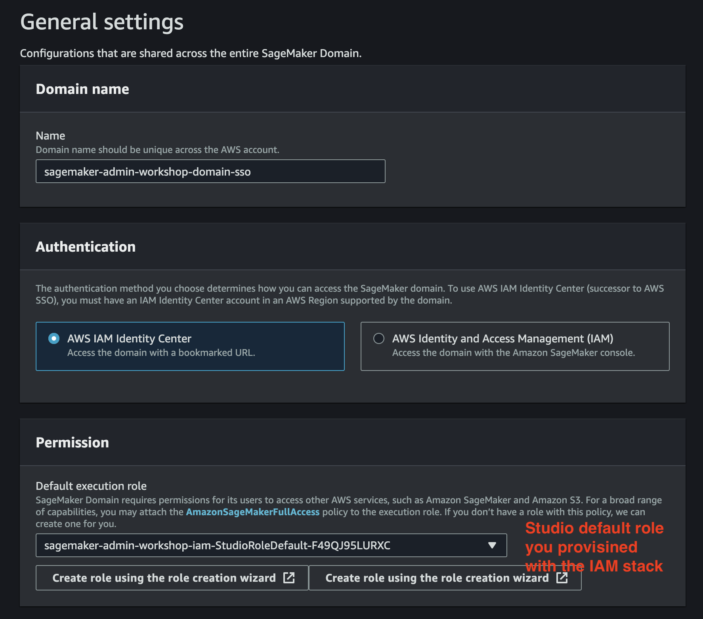

- **Network and Storage Section**:
    - _VPC_: Choose the `vpc-sagemaker-admin-workshop` VPC you provisioned in the previous step
    - _Subnet_: Choose both private subnets `<REGION>a private-sn-1a-sagemaker-admin-workshop` and `<REGION>b private-sn-2a-sagemaker-admin-workshop`
    - _Security group(s)_: Choose the `sg-sm-sagemaker-admin-workshop` security group
    - Choose _VPC Only_ option
    - _Encryption key_: Choose the AWS KMS key for the Studio EFS volume `sagemaker-admin-workshop-<REGION>-<ACCOUNT-ID>-kms-efs` you provisioned in the previous step

    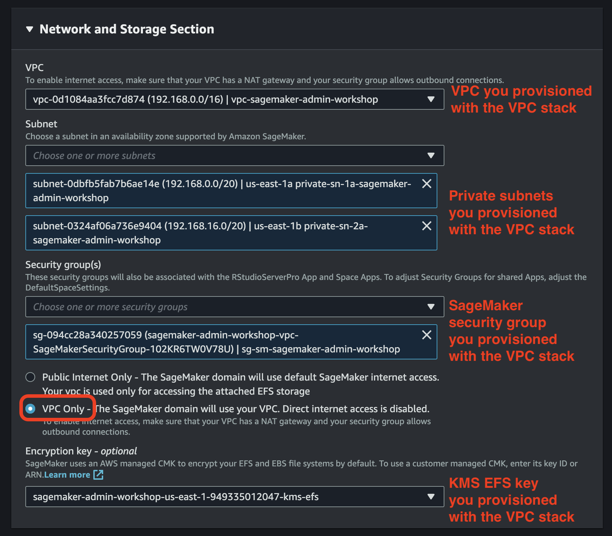

### Studio settings
- **Jupyter Lab version**
    - Leave `Jupyter Lab 3.0` version
- **Notebook Sharing Configuration**
    - _Encryption key_: Choose the AWS KMS key for the S3 bucket `sagemaker-admin-workshop-<REGION>-<ACCOUNT-ID>-kms-s3` you provisioned in the previous step
    - Choose _Disable cell output sharing_
- **SageMaker Project and JumpStart**
    - Leave all options enabled

#### Amazon SageMaker Canvas settings
Disable all configurations. If you keep Canvas configuration enabled, SageMaker adds `AmazonSageMakerCanvasFullAccess` and `AmazonSageMakerCanvasAIServiceAccess` managed policies to the default SageMaker execution role. At this point we don't want to attach any other policies to this role.

### Finish domain provisioning
Choose **Submit** and wait until the domain goes into `InService` status:

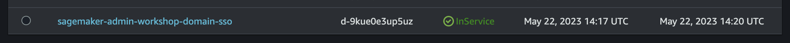

## Manage users and user groups in IAM Identity Center
You manage account sign-in, entitlements, and application access for users in [IAM Identity Center](https://docs.aws.amazon.com/singlesignon/latest/userguide/what-is.html). IAM Identity Center allows users to federate directly into SageMaker Studio from IAM portal or SAML Identity Provider (IdP) without need to sign in the AWS account first.

For the theoretical part of the user management using IdP federation refer to [Identity management in SageMaker Studio Administration Best Practices](https://docs.aws.amazon.com/whitepapers/latest/sagemaker-studio-admin-best-practices/identity-management.html).

In this lab you're going to implement user federation using Identity Center directory as the [identity source](https://docs.aws.amazon.com/singlesignon/latest/userguide/manage-your-identity-source.html).

### Create user groups
In this section you're going to create two new user groups in IAM Identity Center. As the prerequisite you must have IAM Identity Center enabled and have an administrator-level permissions to be able to create users and groups.

1. Open the [IAM Identity Center console](https://console.aws.amazon.com/singlesignon)
2. In the navigation pane, choose **Groups** 
3. On the **Groups** pane, choose **Create group** 
4. Enter the group name, for example `sagemaker_datascientist` and choose **Create group**

Repeat the same steps and create another group called `sagemaker_mlops`.

### Create users
Follow the [add user](https://docs.aws.amazon.com/singlesignon/latest/userguide/addusers.html) instructions and create two users in Identity Center, for example `user1-data-scientist` and `user2-mlops`.  Complete user setup by confirming user emails.

Add the `user1-data-scientist` to the group `sagemaker_datascientist` and the `user2-mlops` to `sagemaker_mlops`.

In the following sections you're going to assign these groups and users to the SageMaker domain.

## Manage SageMaker user profiles
In the domain in IAM Identity Center authentication mode, each user is mapped to one and only one user profile. The domain can _automatically_ create a user profile when an entitled user federates in the Studio first time or a particular IAM Identity Center user assigned to the domain in the AWS Console UX.

The domain uses the default execution role defined at the domain level as the user profile execution role. If you'd like to assign a specific execution role to the user profile or configure other user profile-specific settings, you need to update the user profile using [`UpdateUserProfile`](https://docs.aws.amazon.com/sagemaker/latest/APIReference/API_UpdateUserProfile.html) API call.

### Create user profile
There are following methods to add a new user to domain:
1. **From the Amazon SageMaker console** - select **Assign users and groups** in the domain details:
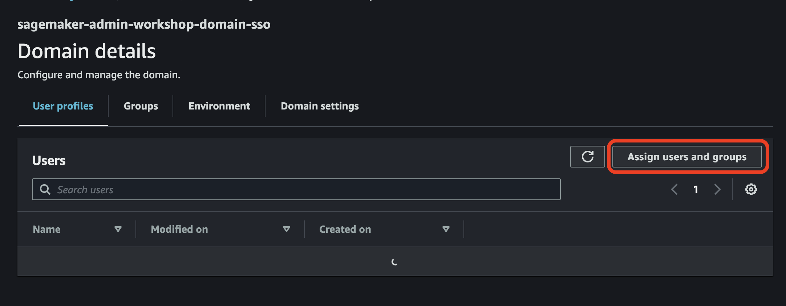
You can select users or groups from IAM Identity Center which need to be added to the domain. 
If you assign a user, a new user profile is created automatically immediately. If you assign a group, a new user profile is created first time the user federates in the Studio.

2. **Using the AWS CLI or AWS CloudFormation** - you can use [`CreateUserProfile`](https://docs.aws.amazon.com/sagemaker/latest/APIReference/API_CreateUserProfile.html) API or [`create-user-profile`](https://awscli.amazonaws.com/v2/documentation/api/latest/reference/sagemaker/create-user-profile.html) AWS CLI call to create a new user profile programmatically. You must set the `single-sign-on-user-identifier` (`SingleSignOnUserIdentifier`) to `UserName` and `single-sign-on-user-value` (`SingleSignOnUserValue`) to the username of the corresponding user in IAM Identity Center. For CloudFormation-based creation of user profiles use the[`AWS::SageMaker::UserProfile`](https://docs.aws.amazon.com/AWSCloudFormation/latest/UserGuide/aws-resource-sagemaker-userprofile.html) resource.

❗ You must first assign a user or a group to the domain before user can federate in the Studio from the AWS access portal.

### Configure user profile
As mentioned above, the domain creates user profile _automatically_ if you use AWS Console UX to assign a particular user to the domain or a user federates into Studio first time.

Each user profile in the domain can contain profile-specific user settings, such as profile execution role, Canvas app, Jupyter Server, and Kernel Gateway settings. For the full list of profile-specific settings, refer to the `UserSettings` JSON structure in the [`CreateUserProfile`](https://docs.aws.amazon.com/sagemaker/latest/APIReference/API_CreateUserProfile.html) API documentation.

You can use the following three patterns to configure user profile.

#### Pattern 1: Configure user profiles up-front statically
After domain provisioning, explicitly create user profiles for IdP federated users based on the IdP or AD group membership and attributes by using [`CreateUserProfile`](https://docs.aws.amazon.com/sagemaker/latest/APIReference/API_CreateUserProfile.html) API. You can configure each profile based on some metadata, for example taken from IdP or other metadata or entitlement store. 

This approach is static as everything must be provisioned up-front, including user profiles for every anticipated domain user. You also need to develop some IdP sync mechanism for user profile housekeeping and profile configuration updates based on the changes on the IdP or AD side. Refer to [Identity management](https://docs.aws.amazon.com/whitepapers/latest/sagemaker-studio-admin-best-practices/identity-management.html) in SageMaker Studio Administration Best Practices for some implementation examples using AWS Lambda and SAML 2.0 assertion.

Use this pattern if your user base is rather static or slowly changing and you don't need to update user profile often. This pattern is a good fit for smaller teams and simple organizational setup without many SageMaker domains in use.

#### Pattern 2: Create and configure user profiles on user sign-in
Implement a [custom SAML 2.0 application](https://docs.aws.amazon.com/singlesignon/latest/userguide/samlapps.html) in IAM Identity Center or use a custom API with any IdP to control user federation into the SageMaker domain. For example, refer to [SageMaker Studio access using SAML assertion](https://docs.aws.amazon.com/whitepapers/latest/sagemaker-studio-admin-best-practices/appendix.html#sagemaker-studio-access-using-saml) for the implementation details. The SageMaker domain must be in IAM authentication mode.

With this approach you don't need to create user profiles in the domain up-front or assign users or groups to the domain. You need to implement a sign-in process including user identity validation and authorization. With this full flexibility you can support complex team and organizational setups, including multi-team and multi-domain. By controlling the user sign-in process you can implement one user to many user profile pattern.

#### Pattern 3: Configure user profiles on `CreateApp` event
After a user signed into the domain from AWS access portal and profile is created automatically, call an AWS Lambda function and configure the profile ex post, for example set the profile execution role. 

For example, you can configure an Amazon EventBridge rule with the event pattern:
```json
{
    "source": ["aws.sagemaker"],
    "detail-type": ["AWS API Call via CloudTrail"],
    "detail": {
        "eventSource": ["sagemaker.amazonaws.com"],
        "eventName": ["CreateApp"]
    }
}
```

EventBridge launches this rule every time a new app is created for the user profile. The event's request parameters contain all needed information to identify the app type, the user profile name, and the domain id:
```json
"requestParameters": {
        "domainId": "<DOMAIN-ID>",
        "userProfileName": "<USER PROFILE NAME>",
        "appType": "JupyterServer",
        "appName": "default",
        "tags": []
}      
```

You can update user profile and set the designated execution role and other user-specific settings by calling `UpdateUserProfile` API. Note, that you cannot update the user profile and `UpdateUserProfile` API call will fail if the JupyterServer app is in `InService` status. The user profile must be updated when there are no user app running or the JupyterServer app isn't in `InService` status.

### Experiment with user profiles
In this section you're going to try several approaches to create a new user profile in the domain in IAM Identity Center mode and learn how to configure the profiles.

In the previous section you created the following groups and users in IAM Identity Center:
- Group `sagemaker_datascientist`
    - User `user1-data-scientist`
- Group `sagemaker_mlops`
    - User `user2-mlops`

#### Add user to domain via SageMaker console
Open Amazon SageMaker console and choose the domain in IAM Identity Center mode you created in the previous step. Choose **Assign user and groups**:


The SageMaker automatically populates the user and group lists with the users and groups from IAM Identity Center:

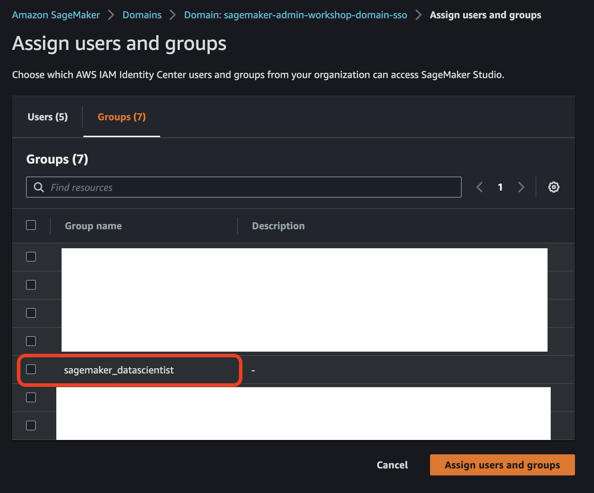

Choose `sagemaker_datascientist` in the group list and choose **Assign user and groups**.

Your workforce identities, more _all users_ which belong to the `sagemaker_datascientist` group, can now access the Studio without need to sign in to the AWS account.

Now sign in the [AWS access portal](https://docs.aws.amazon.com/singlesignon/latest/userguide/using-the-portal.html) as the `user1-data-scientist` user. 

This user has Amazon SageMaker Studio as an available application in the portal:

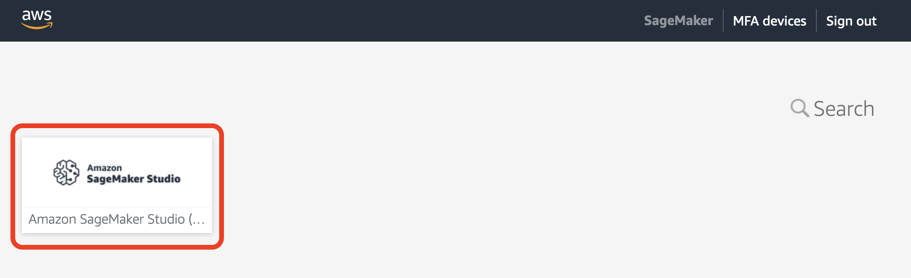

Sign in to the Studio by selecting the Studio icon. You'll redirected to a new browser window.

After a few moments, you'll see that there is a problem with your sign-in:
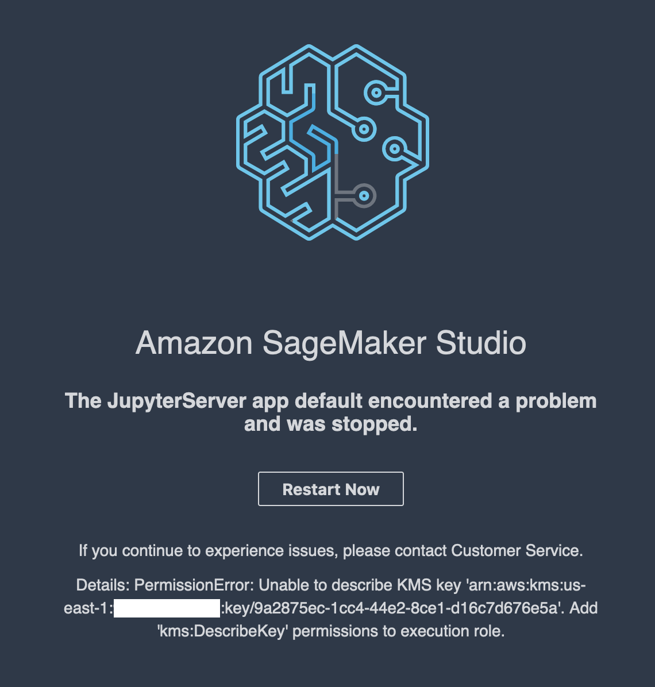

The reason for the sign-in failure is that the SageMaker default execution role which is used as the execution role for each new user profile doesn't have access to the AWS KMS encryption key as per role permission policy. As you might recall, you configured the domain to use this KMS key for Studio EFS encryption. Now each user profile needs to have access to the AWS KMS EFS key to be able to sign in the Studio.

Let's fix this problem.

##### Describe user profile
We use AWS CLI to run terminal commands, but you can also use SageMaker console UI for all actions in this section.

First, list all user profiles in the domain. Replace `<DOMAIN-ID>` with the domain id.
```sh
aws sagemaker list-user-profiles \
    --domain-id <DOMAIN-ID>
```

You have only one user profile in the command output:
```json
{
    "UserProfiles": [
        {
            "DomainId": "d-9kue0e3up5uz",
            "UserProfileName": "user1-data-scientist-<NNN>",
            "Status": "InService",
            "CreationTime": "2023-05-30T14:29:13.154000+02:00",
            "LastModifiedTime": "2023-05-30T14:29:15.357000+02:00"
        }
    ]
}
```
This user profile has been automatically created when you tried to sign in the Studio.

Second, use the `UserProfileName` to describe the profile to see more details:
```sh
aws sagemaker describe-user-profile \
    --domain-id <DOMAIN-ID> \
    --user-profile-name <USER-PROFILE-NAME>
```

As you see in the command output, there is no profile-specific execution role. The profile uses the default execution role defined at the domain level:
```json
{
    "DomainId": "d-9kue0e3up5uz",
    "UserProfileArn": "arn:aws:sagemaker:us-east-1:<ACCOUNT-ID>:user-profile/d-9kue0e3up5uz/sagemaker-developer-1-471",
    "UserProfileName": "user1-data-scientist-<NNN>",
    "HomeEfsFileSystemUid": "200010",
    "Status": "InService",
    "LastModifiedTime": "2023-05-30T14:29:15.357000+02:00",
    "CreationTime": "2023-05-30T14:29:13.154000+02:00",
    "SingleSignOnUserIdentifier": "UserName",
    "SingleSignOnUserValue": "sagemaker-developer-1"
}
```

You can also see the profile details in the SageMaker console by choosing the profile in the **Domain details** pane:

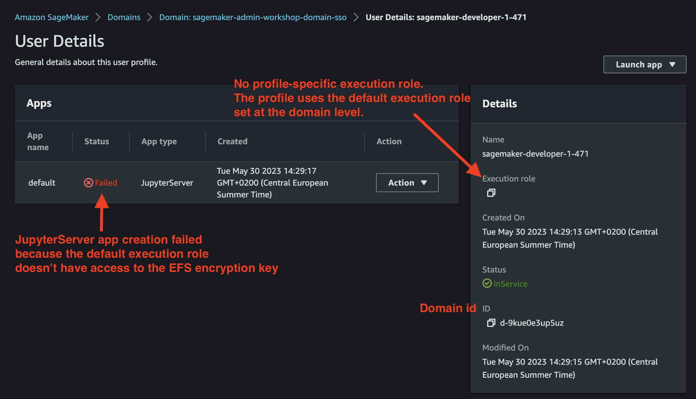

##### Update user profile
Let's update the user profile and set the correct execution role.

First, print the output of the CloudFormation stack you used to provision the execution roles:
```sh
aws cloudformation describe-stacks \
    --stack-name sagemaker-admin-workshop-iam  \
    --output table \
    --query "Stacks[0].Outputs[*].[OutputKey, OutputValue]"
```

You need to use the value of `StudioRoleDataScienceArn` parameter as the execution role ARN for the next command. This execution role has access to the KMS key as per its permission policy.

Second, update the user profile using the following command. Replace the `<STUDIOROLE-DATASCIENCE-ARN>` with the role's ARN:
```sh
aws sagemaker update-user-profile \
    --domain-id <DOMAIN-ID> \
    --user-profile-name <USER-PROFILE-NAME> \
    --user-settings '{"ExecutionRole":"<STUDIOROLE-DATASCIENCE-ARN>"}'

```

Third, call `describe-user-profile` again:
```sh
aws sagemaker describe-user-profile \
    --domain-id <DOMAIN-ID> \
    --user-profile-name <USER-PROFILE-NAME>
```

Now you see a new section `UserSettings` and the profile-specific `ExecutionRole` in the command output:
```json
{
    "DomainId": "d-9kue0e3up5uz",
    "UserProfileArn": "arn:aws:sagemaker:us-east-1:<ACCOUNT-ID>:user-profile/d-9kue0e3up5uz/user1-data-scientist-<NNN>",
    "UserProfileName": "user1-data-scientist-<NNN>",
    "HomeEfsFileSystemUid": "200010",
    "Status": "InService",
    "LastModifiedTime": "2023-05-30T15:04:41.441000+02:00",
    "CreationTime": "2023-05-30T14:29:13.154000+02:00",
    "SingleSignOnUserIdentifier": "UserName",
    "SingleSignOnUserValue": "user1-data-scientist",
    "UserSettings": {
        "ExecutionRole": "arn:aws:iam::<ACCOUNT-ID>:role/sagemaker-admin-workshop-iam-StudioRoleDataScience-WDT8LXMFY2TX"
    }
}
```

You can navigate back to the browser window with Studio sign-in and select **Restart Now**:

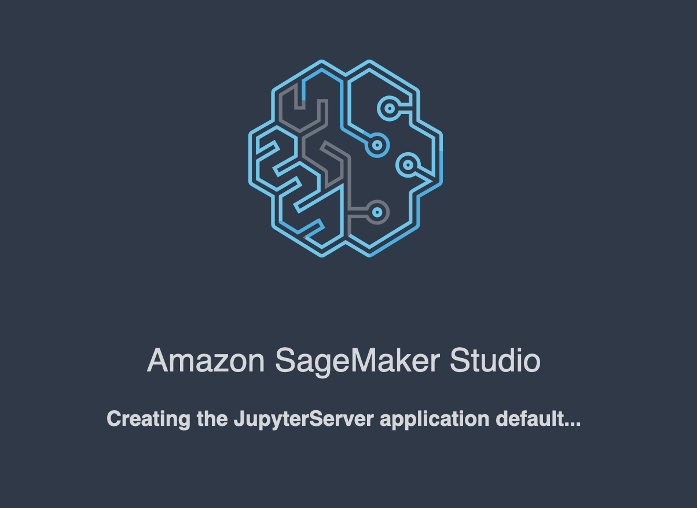

After several minutes the JupyterServer app is created and you'll see the **Home** screen in the Studio and the corresponding user profile name of the signed-in user:

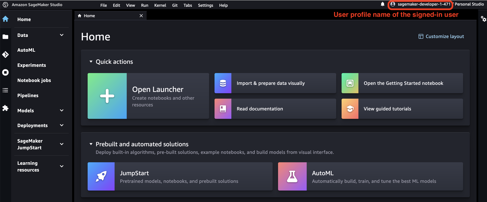

#### Add user to domain programmatically
In this section you're going to use AWS CLI to assign a user to the domain and create a new user profile.

##### Create user profile
You create a new user profile in the domain before the user can federate in the Studio first time. You're going to use MLOps execution role you provisioned with the CloudFormation stack.

First, print the stack output:
```sh
aws cloudformation describe-stacks \
    --stack-name sagemaker-admin-workshop-iam  \
    --output table \
    --query "Stacks[0].Outputs[*].[OutputKey, OutputValue]"
```

You need to use the value of `StudioRoleMLOpsArn` parameter as the execution role ARN for the next command.

Second, create a new user profile in the domain using the following AWS CLI command. Use the username for the `user2-mlops` in the IAM Identity Center, it's `user2-mlops` if you used the proposed user name. Replace the `<STUDIOROLE-MLOPS-ARN>` with the role's ARN and `<USERNAME FROM IAM IDENTITY CENTER>` with `user2-mlops`:
```sh
aws sagemaker create-user-profile \
    --domain-id <DOMAIN-ID> \
    --user-profile-name user2-mlops \
    --single-sign-on-user-identifier UserName \
    --single-sign-on-user-value <USERNAME FROM IAM IDENTITY CENTER> \
    --user-settings '{"ExecutionRole":"<STUDIOROLE-MLOPS-ARN>"}'
```
This command creates a new user profile mapped to the specific user identity from the IAM Identity Center. By creating the user profile you assigned the user with the specific user name to the domain and user can sign in to the Studio from the AWS access portal.

Third, list the user profile in the domain:
```sh
aws sagemaker list-user-profiles \
    --domain-id <DOMAIN-ID>
```
The output contains two user profiles now.

##### Sign-in to Studio
Clear session cookies in the browser or use another browser before you sign in the AWS access portal. You can find the link to the AWS access portal in the IAM Identity Center dashboard. Sign in as the user `user2-mlops`. This user has Amazon SageMaker Studio as an available application in the portal.

Sign in to the Studio by selecting the Studio icon. You'll redirected to a new browser window. This time there is no problem with JupyterServer app creation as the user profile uses the designated execution role with the necessary permissions for the KMS encryption key.

After several minutes the JupyterServer app is created and you'll see the **Home** screen in the Studio and the corresponding user profile name of the signed-in user:

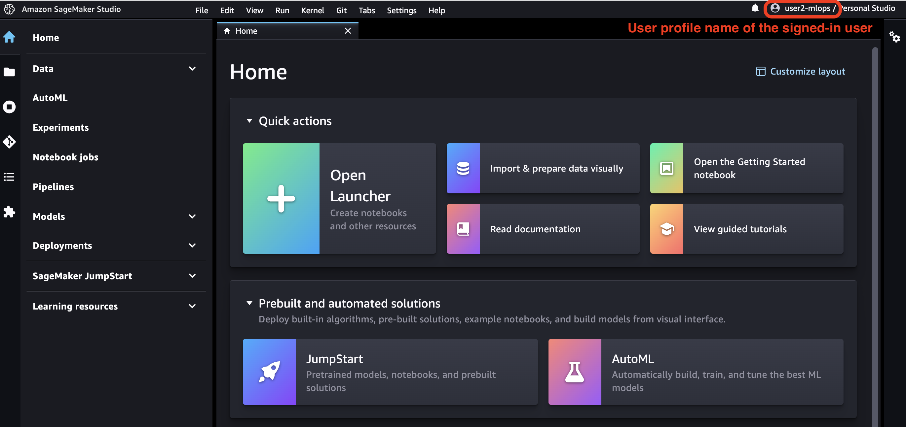

You can also see the profile details in the SageMaker console by navigating to the user details:

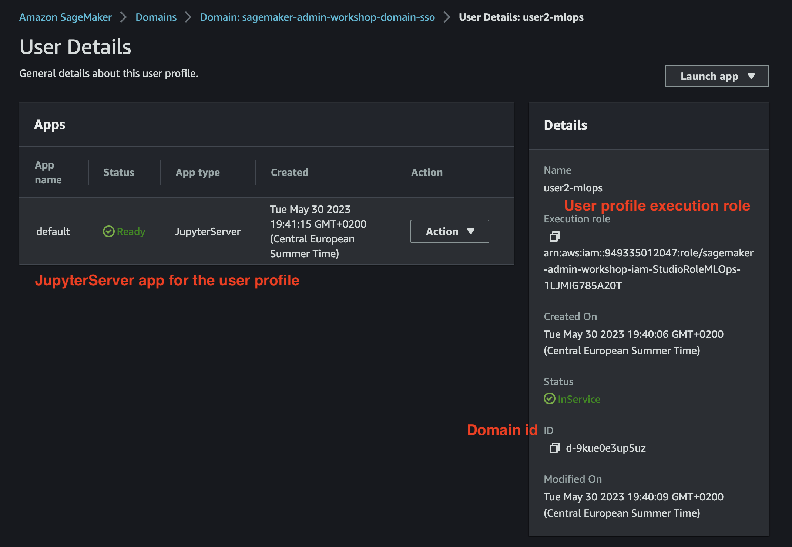

Since the IAM Identity Center user `user2-mlops` belongs to the group `sagemaker_mlops`, you could assign the whole group to the domain via AWS Console UX and entitled all users in the group to federate in the Studio.

## Conclusion
In this lab you learned how to create a domain in IAM Identity Center authentication mode, how to onboard users to the domain, and how to create and manage user profiles using different approaches.

## Additional resources
The following resources provide additional details and reference for IAM Identity Center related topics.
- [Identity management in SageMaker Studio Administration Best Practices](https://docs.aws.amazon.com/whitepapers/latest/sagemaker-studio-admin-best-practices/identity-management.html)
- [Onboard users to Amazon SageMaker Studio with Active Directory group-specific IAM roles](https://aws.amazon.com/blogs/machine-learning/onboard-users-to-amazon-sagemaker-studio-with-active-directory-group-specific-iam-roles/)
- [Secure Amazon SageMaker Studio presigned URLs Part 1: Foundational infrastructure](https://aws.amazon.com/blogs/machine-learning/secure-amazon-sagemaker-studio-presigned-urls-part-1-foundational-infrastructure/)
- [Onboarding Amazon SageMaker Studio with AWS SSO and Okta Universal Directory](http://aws.amazon.com/blogs/machine-learning/onboarding-amazon-sagemaker-studio-with-aws-sso-and-okta-universal-directory/)

---

[Back to the Lab 1](./lab-01.md)

---

Copyright Amazon.com, Inc. or its affiliates. All Rights Reserved.
SPDX-License-Identifier: MIT-0
