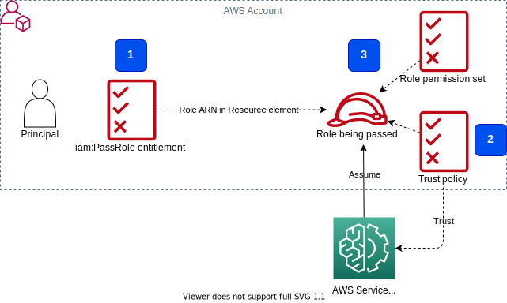

# IAM PassRole in Amazon SageMaker context
[AWS IAM documentation on pass role](https://docs.aws.amazon.com/IAM/latest/UserGuide/id_roles_use_passrole.html)

## Overview
AWS IAM "pass role" mechanism allows a principal with some privileges to pass an IAM role with a different permission set to an AWS service. The service assumes the role later and perform actions on your behalf. The principal **must have** permissions (`iam:PassRole`) to pass a **specific** role to a **specific** service or services. You define which roles the user can pass with the `Resources` element of the `iam:PassRole` statement. To define which service the role can be passed you use [`iam:PassedToService`](https://docs.aws.amazon.com/IAM/latest/UserGuide/reference_policies_iam-condition-keys.html#ck_PassedToService) condition key. For example:

```json
{
    "Effect": "Allow",
    "Action": [
        "iam:PassRole"
    ],
    "Resource": "arn:aws:iam::*:role/*AmazonSageMaker*",
    "Condition": {
        "StringEquals": {
            "iam:PassedToService": [
                "glue.amazonaws.com",
                "robomaker.amazonaws.com",
                "states.amazonaws.com"
            ]
        }
    }
}
```
This IAM permission policy statement entitles a principal to pass a role matching the wildcard `*AmazonSageMaker*` to any of three specified services.

When writing policies for `iam:PassRole` it is best practice to place `iam:PassRole` permissions in their own statements within a policy so that resources/conditions that apply to other IAM actions do not impact the `iam:PassRole` operation, This reduces the chance of a principal being inadvertently given PassRole to too many resources, and for the creation of PassRole statements that can be modified without modifying other entitlements.

The role being passed must have a trust policy with a specific AWS service, like in the following code snippet:
```yaml
AssumeRolePolicyDocument:
  Version: "2012-10-17"
  Statement:
    - Effect: "Allow"
      Principal:
        Service: 
          - servicecatalog.amazonaws.com
          - codepipeline.amazonaws.com
          - lambda.amazonaws.com
          - sagemaker.amazonaws.com
      Action: "sts:AssumeRole"
```

The trust policy allows a designated AWS service to assume this IAM role.

## Prerequisites for PassRole
To summarize: In order for a role to be passed to a service, three pre-requisites must be met:

1. The principal attempting to pass the role to the service has the `iam:PassRole` entitlement with the role desired to be passed in the `Resource` field, **and all IAM conditions met**.
2. The role being passed is configured to trust the service principal of the service you're trying to pass it to. e.g. a role that trusts only Lambda cannot be passed to Amazon EC2, and a role that is only configured for assumption with saml cannot be passed to Amazon Redshift
3. The role being passed is in the same AWS account as the principal attempting to pass it



## API calls which require PassRole permission
In SageMaker context you normally attach `iam:PassRole` permission to the SageMaker execution role. The SageMaker execution role can pass specific roles with specific permissions to SageMaker processing and training jobs, pipelines, inference endpoints (`sagemaker.amazonaws.com` service), and other used services, for example to `lambda.amazonaws.com`.

Refer to [documentation](https://docs.aws.amazon.com/sagemaker/latest/dg/sagemaker-roles.html) on `PassRole` in SageMaker context.

Here is an incomplete list of **SageMaker API calls** which require `iam:PassRole` permission:
```
sagemaker:CreateAlgorithm	ValidationSpecification.ValidationRole
sagemaker:CreateAutoMLJob	RoleArn
sagemaker:CreateCompilationJob	RoleArn
sagemaker:CreateDomain	DefaultUserSettings.ExecutionRole
sagemaker:CreateFlowDefinition	RoleArn
sagemaker:CreateHyperParameterTuningJob	TrainingJobDefinition.RoleArn
sagemaker:CreateLabelingJob	RoleArn
sagemaker:CreateModel	ExecutionRoleArn
sagemaker:CreateModelPackage	ValidationSpecification.ValidationRole
sagemaker:CreateMonitoringSchedule	MonitoringScheduleConfig.MonitoringJobDefinition.RoleArn
sagemaker:CreateNotebookInstance	RoleArn
sagemaker:CreateProcessingJob	RoleArn
sagemaker:CreateTrainingJob	RoleArn
sagemaker:CreateUserProfile	UserSettings.ExecutionRole
sagemaker:RenderUiTemplate	RoleArn
sagemaker:UpdateDomain	DefaultUserSettings.ExecutionRole
sagemaker:UpdateMonitoringSchedule	MonitoringScheduleConfig.MonitoringJobDefinition.RoleArn
sagemaker:UpdateNotebookInstance	RoleArn
sagemaker:UpdateUserProfile	UserSettings.ExecutionRole
```

[Here](https://gist.github.com/noamsdahan/928aafbcca71f95b07472f22e35dc93c) is the list of other AWS API calls which may require `iam:PassRole` permission.

You assign a **different permission set** to the SageMaker job execution roles comparing to user profile execution roles. The privileges assignment should follow the principle of the least required permissions needed to fulfill the job.

The privileges associated with a passed role are **different** and can be **higher** than those of the principal passing the role.

## Recommended practices for using PassRole
If you setup `iam:PassRole` pre-requisites incorrectly, it effectively can lead to privilege escalation. 
For example, if an someone had an entitlement to pass a role to an AWS service and also access that service's credentials or pass it code to execute(e.g. launch an EC2 instance with a highly privileged role, then access the EC2 instance) they would be able to elevate their access to the equivalent of the role they had passed. Thus it is important to ensure that roles for AWS services follow least privilege and to constrain what roles a given principal can pass to an AWS service.

Some IAM privilege escalation via `iam:PassRole` scenarios are described in [AWS IAM Privilege Escalation – Methods and Mitigation](https://rhinosecuritylabs.com/aws/aws-privilege-escalation-methods-mitigation/) blog post. The same post gives the mitigation actions.

`iam:PassRole` is an extremely precise means of delegating a permission set to an AWS service or resource. It's explicitly controlled by fine-grain policy statements and there is nothing about it's use or functionality that should be considered "privilege escalation", only the wrong use and setup of the pre-requisites.

You must be precise about the **roles** that a given **principal** is able to pass, what **services** they can pass them to, how those roles are constrained with **permission boundaries** (if not centrally created), and what permissions the passed roles delegate.

You can use [IAM condition context keys](https://docs.aws.amazon.com/IAM/latest/UserGuide/reference_policies_iam-condition-keys.html) `iam:AssociatedResourceARN` and `iam:PassedToService` to control to what service and to what principal a role can be passed. For example:
```json
{
    "Effect": "Allow",
    "Action": "iam:PassRole",
    "Resource": "*",
    "Condition": {
        "StringEquals": {"iam:PassedToService": "ec2.amazonaws.com"},
        "StringLike": {
            "iam:AssociatedResourceARN": [
                "arn:aws:ec2:us-east-1:111122223333:instance/*",
                "arn:aws:ec2:us-west-1:111122223333:instance/*"
            ]
        }
    }
}
```

We recommend to implement monitoring and auditing of PassRole permission usage, for example by leveraging [AWS CloudTrail](https://aws.amazon.com/cloudtrail/) logs. Furthermore, you should ensure and enforce a proper usage of PassRole in any IAM permission policy. For example, never allow PassRole to "*" resource and to **any** principal. Use `Resource` and `Condition` statements to control the role which can be passed and the principal the role can be passed to.

## Conclusion
`iam:PassRole` is not an API call. It does not have an entry in AWS CloudTrail. It is an entitlement required by an IAM principal to pass a role to an AWS service. If a principal is attempting to perform an action that requires `iam:PassRole` but lacks the entitlement to so, the action will fail and usually generate an error message about IAM PassRole failing.

Look at this blog post [Auditing PassRole: A Problematic Privilege Escalation Permission](https://ermetic.com/blog/aws/auditing-passrole-a-problematic-privilege-escalation-permission/) for a deep dive in potential security risks with PassRole and mitigation mechanisms.

Another useful privilege escalation mitigation approach is [IAM permission boundaries](https://docs.aws.amazon.com/IAM/latest/UserGuide/access_policies_boundaries.html). With a permission boundary you can set the maximum permissions that an identity-based policy can grant to an IAM principle. Refer to [this hands-on lab](https://www.wellarchitectedlabs.com/security/300_labs/300_iam_permission_boundaries_delegating_role_creation/) in the AWS Well-Architected workshop.

---

[Back to the Lab 1](./lab-01.md)

---

Copyright Amazon.com, Inc. or its affiliates. All Rights Reserved.
SPDX-License-Identifier: MIT-0