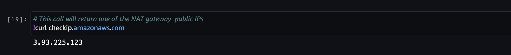
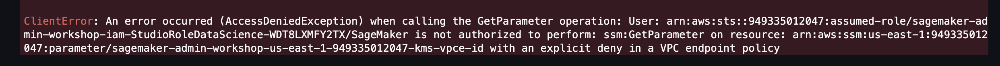

# Lab 1: Amazon SageMaker domain setup, network security, IAM, and user management
This lab shows how to create a secure environment for your data science workloads, starting with the network. You learn concepts of SageMaker domain, domain authentication and network modes, and network traffic controls. Additionally you provision and experiment with IAM execution roles, permission policies, and AWS KMS encryption keys.

---

## What you're going to learn in this lab
In this lab you're going to implement a foundational setup for your SageMaker environment by performing the following tasks:
- Create SageMaker IAM execution roles for Studio users
- Create AWS KMS keys for data encryption
- Setup Amazon VPC and a network perimeter
- Onboard to Amazon SageMaker domain
- Experiment with IAM and IAM Identity Center authentication modes
- Create and configure user profiles
- Control access to Studio with presigned domain URLs
- Experiment with network controls
- Use VPC endpoints and VPC endpoint policies to control egress and service access
- Use network isolation in SageMaker jobs
- Log IP traffic in your VPC using [VPC Flow Logs](https://docs.aws.amazon.com/vpc/latest/userguide/flow-logs.html)

## Overview of SageMaker domain, user profiles, and execution roles

### Domain
A [SageMaker domain](https://docs.aws.amazon.com/sagemaker/latest/dg/sm-domain.html) consists of an associated Amazon Elastic File System (Amazon EFS) volume; a list of authorized users; and a variety of security, application, policy, and Amazon Virtual Private Cloud (Amazon VPC) configurations.

Refer to the [Dive deep into Amazon SageMaker Studio Notebooks architecture](https://aws.amazon.com/blogs/machine-learning/dive-deep-into-amazon-sagemaker-studio-notebook-architecture/) blog post for in-depth overview of SageMaker domain and Studio architecture.

### User profile
A [user profile](https://docs.aws.amazon.com/sagemaker/latest/dg/domain-user-profile.html) represents a single user within a Domain. It is the main way to reference a user for the purposes of sharing, reporting, and other user-oriented features. This entity is created when a user onboards the Amazon SageMaker Domain.

The user profile's Studio application is directly associated with the user profile and has an isolated Amazon EFS directory, an execution role associated with the user profile, and Kernel Gateway applications.

### EFS volume
Each domain has a dedicated EFS volume which is used by all users within the domain. Each user profile has own private home directory. The home directories cannot be share between users. The EFS manages access to the home directory using a POSIX user ID.

### User profile execution role
Each user profile has a designated IAM execution role which is part of the user profile settings. This role must have, at a minimum, an attached trust policy that grants SageMaker permission to assume the role:
```json
{
    "Statement": [
        {
            "Effect": "Allow",
            "Principal": {
                "Service": "sagemaker.amazonaws.com"
            },
            "Action": "sts:AssumeRole"
        }
    ]
}
```

User perform all activities in Studio and Studio notebooks under this execution role. This role's permissions control what a specific user can do in Studio and what resources can be accessed and operated from the Studio notebooks.

Refer to [SageMaker roles](https://docs.aws.amazon.com/sagemaker/latest/dg/sagemaker-roles.html) in the Developer Guide for more details on the execution roles.

### Execution role setup
The following diagram shows the recommended setup of execution roles:


1. All users are authenticated and authorized by IAM and sign in the AWS console of the AWS account. Alternatively, users can be authenticated and authorized in your organization IdP and federated into AWS account using [AWS IAM Identity Center](https://docs.aws.amazon.com/singlesignon/latest/userguide/what-is.html).
2. The user IAM role controls what the user can do in AWS console and the AWS account.
3. IAM role permission policies define access to operations, resources, and data.
4. SageMaker domain contains a designated user profile the user can sign in to. Domain supports IAM or IAM Identity Center authentication mode.
5. Each profile has a dedicated execution role which defines what the user can do in Studio and Studio notebooks.
6. The recommended practice is to to create dedicated IAM roles for the execution of SageMaker jobs, SageMaker Pipelines, model deployment, hosting, and monitoring. Each IAM role must follow the least privilege principle. You must scope each execution role based on the actions it needs to perform and the data and resources it needs to access.
7. If you use [AWS Organizations](https://aws.amazon.com/organizations/), you can leverage [Service Control Policies](https://docs.aws.amazon.com/organizations/latest/userguide/orgs_manage_policies_scps.html) (SCPs) to centrally control the maximum available permissions for all accounts and all IAM roles in your organization. The SCP is an effective way to limit permissions given by IAM permission policies attached to the IAM roles.

But enough theory for the moment and let's move to the hands-on exercises!

## Step 1: create SageMaker IAM execution roles
You have the following options to provision required SageMaker IAM execution roles:
- Use your own operational process for IAM role provisioning and management
- Use infrastructure as code (IaC) approach such as CloudFormation templates
- Use SageMaker [role manager](https://docs.aws.amazon.com/sagemaker/latest/dg/role-manager.html) interactively in the AWS Console. In the SageMaker role manager you can provision roles based on pre-defined [persona references](https://docs.aws.amazon.com/sagemaker/latest/dg/role-manager-personas.html).

This workshop uses a CloudFormation [template](../../cfn-templates/iam-roles.yaml) to provision the following IAM roles:
- `StudioRoleDefault`: minimal privilege role which is used as default for the SageMaker domain
- `StudioRoleDataScience`: user profile execution role scoped for _Data Scientist_ persona
- `StudioRoleMLOps`: user profile execution role scoped for _MLOps engineer_ persona
- `VPCFlowLogsRole`: VPC Flow Logs role for publishing logs to CloudWatch

Take some time to examine the attached permission policies for each role. Consider the following:
- None of the roles has [`AmazonSageMakerFullAccess`](https://docs.aws.amazon.com/sagemaker/latest/dg/security-iam-awsmanpol.html) policy attached and each has only a limited set of permissions. In your real-world SageMaker environment you need to scope the role's permissions based on your requirements for operations and data access.
- `StudioRoleDefault` has only a custom policy `SageMakerReadOnlyPolicy` attached with a restrictive list of allowed actions. 
-  Both user profile execution roles, `StudioRoleDataScience` and `StudioRoleMLOps`, additionally have custom polices `SageMakerStudioDataScienceAccessPolicy` and `SageMakerStudioMLOpsAccessPolicy` allowing usage of particular services on per-persona-role basis.
- Each user profile execution role has a deny-only policy `SageMakerDeniedServicesPolicy` with explicit deny on some potentially destructive SageMaker API calls, such as `DeleteDomain` and `DeleteUserProfile`. The policy also denies using SageMaker Notebook Instances.
- User profiles execution roles have access to any S3 bucket with `SageMaker` as a part of the bucket name, for example `sagemaker-studio-949335012047-k7i6idl1eep`. You'll manage fine-grained S3 permissions in the [data security lab](../02-lab-02/lab-02.md).
- The permission policy `SageMakerStudioDeveloperAccessPolicy` implements attribute-based access control ABAC using tags on the principal and resources.

In this lab the workshop don't use designated execution roles for SageMaker workloads such as jobs, Pipelines, Model Monitoring and hosting. You'll create and use these execution roles in other labs.

### Deploy the CloudFormation template
Go to your local or Cloud9 terminal and in the workshop directory. Deploy the provided IAM template:
```sh
aws cloudformation deploy \
    --template-file cfn-templates/iam-roles.yaml \
    --stack-name sagemaker-admin-workshop-iam \
    --capabilities CAPABILITY_NAMED_IAM 
```

After the deployment completes, output the ARNs of the provisioned IAM roles:
```sh
aws cloudformation describe-stacks \
    --stack-name sagemaker-admin-workshop-iam  \
    --output table \
    --query "Stacks[0].Outputs[*].[OutputKey, OutputValue]"
```

You need these ARNs for the domain onboarding.

## Step 2: setup SageMaker domain network environment
Before you start with with SageMaker domain creation, you need to setup a network environment. 

### Recommended network setup and practices
While the [Zero Trust](https://aws.amazon.com/security/zero-trust/) conceptual model decreases reliance on network location, the role of network controls and perimeters remains important to the overall security architecture. 

Use [Amazon Virtual Private Cloud](http://aws.amazon.com/vpc/?vpc-blogs.sort-by=item.additionalFields.createdDate&vpc-blogs.sort-order=desc) (Amazon VPC) to enable network isolation and control connectivity to only the services and users you need.

Use [AWS PrivateLink](https://docs.aws.amazon.com/whitepapers/latest/aws-vpc-connectivity-options/aws-privatelink.html) to connect your private services inside the VPC to public AWS services without need to traverse public network and to use an internet gateway in your VPC. 

Use [Security Groups](https://docs.aws.amazon.com/vpc/latest/userguide/VPC_SecurityGroups.html) to control the inbound and outbound traffic for the resources the security group associated with, such as VPC endpoints or [elastic network interface](https://docs.aws.amazon.com/AWSEC2/latest/UserGuide/using-eni.html) (ENI). For monitoring all network traffic on ENIs you can use [VPC Flow Logs](https://docs.aws.amazon.com/vpc/latest/userguide/flow-logs.html).

The following diagram shows a minimal network configuration for the SageMaker domain with the single Availability Zone (AZ) and without internet connectivity for the private subnet:


You don't need to create and configure the EFS security group. This security group and rules are created by SageMaker automatically during creation of the domain.

Each SageMaker domain has own VPC configuration, so you can configure a domain to use a shared or a dedicated VPC. Each domain uses its own EFS file system, data from different domains never shares the same EFS volume.

### Amazon VPC
An Amazon VPC is a logically isolated virtual network environment that you control. When you create an VPC, it doesn't allow ingress or egress network traffic. By adding VPC endpoints, [internet gateways](https://docs.aws.amazon.com/vpc/latest/userguide/VPC_Internet_Gateway.html) (IGW), [NAT gateways](https://docs.aws.amazon.com/vpc/latest/userguide/vpc-nat-gateway.html) (NATGW) or [AWS Transit Gateway](https://docs.aws.amazon.com/whitepapers/latest/building-scalable-secure-multi-vpc-network-infrastructure/transit-gateway.html) you begin to configure your private network environment to communicate with other network resources. In this workshop all communication between your SageMaker domain and any AWS service are done explicitly through private connectivity to the AWS services via VPC endpoints. 

In your production environment we recommend to create multiple subnets in multiple AZs to support high availability and resilience of your ML workloads.

### VPC endpoints
The domain interacts with many AWS services, for example SageMaker, SageMaker API, Amazon S3, Amazon STS, Amazon CloudWatch, and AWS KMS. To keep the network traffic between your VPC workloads and AWS services private, you can use VPC endpoints.

A VPC endpoint allows you to establish a private, secure connection between your VPC and AWS services or services in other VPCs using private IP addresses, as if those services were hosted directly in your VPC.
A VPC endpoint is a managed highly available virtual device. VPC endpoint has an IP address within your VPC. You can control traffic to and from the VPC endpoint by security groups and [endpoint policies](https://docs.aws.amazon.com/vpc/latest/privatelink/vpc-endpoints-access.html).

Security groups and VPC endpoint policies are foundational controls to implement defense-in-depth and bring a multi-layered approach to network security of your environment.

### IP capacity planning
You need to [plan VPC and subnet IP capacity](https://docs.aws.amazon.com/whitepapers/latest/sagemaker-studio-admin-best-practices/network-management.html) to ensure that you you have enough IPs to support the usage volume and expected growth.

SageMaker Studio injects one ENI into your VPC for each unique EC2 instance used to run KernelGateway apps and Studio notebooks. When you launch SageMaker training or processing jobs with a VPC configuration, each job injects two ENIs per subnet per compute instance (one ENI for the data agent and one for the algorithm per instance).

Studio EFS injects an ENI per Availability Zone for an EFS mount target.

Each used VPC endpoint injects an ENI per Availability Zone configured. For example, if you use 10 VPC endpoint to communicate with AWS services and setup your SageMaker domain in three Availability Zones, 30 ENIs are injected into your VPC.

For more details on VPC network planning and configuration, refer to the [Network management](https://docs.aws.amazon.com/whitepapers/latest/sagemaker-studio-admin-best-practices/network-management.html) in the SageMaker Studio Administration Best Practices.

### Provision a VPC
Use the provided CloudFormation [template](../../cfn-templates/network-vpc.yaml) to provision a new VPC or use an existing VPC in your AWS account.

You can use the following commands to get the values of the IAM stack output:
```sh
export DS_ROLE_ARN=$(aws cloudformation describe-stacks \
    --stack-name sagemaker-admin-workshop-iam  \
    --output text \
    --query "Stacks[0].Outputs[?OutputKey=='StudioRoleDataScienceArn'].OutputValue")

export MLOPS_ROLE_ARN=$(aws cloudformation describe-stacks \
    --stack-name sagemaker-admin-workshop-iam  \
    --output text \
    --query "Stacks[0].Outputs[?OutputKey=='StudioRoleMLOpsArn'].OutputValue")

export FLOWLOGS_ROLE_ARN=$(aws cloudformation describe-stacks \
    --stack-name sagemaker-admin-workshop-iam  \
    --output text \
    --query "Stacks[0].Outputs[?OutputKey=='VPCFlowLogsRoleArn'].OutputValue")
```

To deploy the VPC stack run the following AWS CLI command in your terminal in the workshop directory. You can use different CIDR to reflect your own environment.
```sh
export AWS_DEFAULT_REGION=$(aws configure get region)
```

```sh
aws cloudformation deploy \
    --template-file cfn-templates/network-vpc.yaml \
    --stack-name sagemaker-admin-workshop-vpc \
    --parameter-overrides \
    AvailabilityZones=${AWS_DEFAULT_REGION}a\,${AWS_DEFAULT_REGION}b \
    NumberOfAZs=2 \
    VPCCIDR=192.168.0.0/16  \
    PrivateSubnet1ACIDR=192.168.0.0/20 \
    PrivateSubnet2ACIDR=192.168.16.0/20 \
    CreateVPCFlowLogsToCloudWatch=YES \
    VPCFlowLogsRoleArn=$FLOWLOGS_ROLE_ARN
```

After the deployment completes, output the resource ids of the provisioned network resources.
```sh
aws cloudformation describe-stacks \
    --stack-name sagemaker-admin-workshop-vpc  \
    --output table \
    --query "Stacks[0].Outputs[*].[OutputKey, OutputValue]"
```

You can also store the KMS VPC endpoint ID from the stack output, you need this ID for the KMS stack deployment:
```sh
export VPCE_KMS_ID=$(
aws cloudformation describe-stacks \
    --stack-name sagemaker-admin-workshop-vpc  \
    --output text \
    --query "Stacks[0].Outputs[?OutputKey=='VPCEndpointKMSId'].OutputValue"
)
```

## Step 3: create AWS KMS keys
When a domain is created, an EFS volume is created for use by all of the users within the domain. Each user receives a private home directory within the EFS volume for notebooks, Git repositories, and data files.

SageMaker uses the Amazon Web Services Key Management Service (Amazon Web Services KMS) to encrypt the EFS volume attached to the domain with an Amazon Web Services managed key by default. For more control, you can specify a customer managed key. 

You can specify the customer managed key only at the time of domain creation and cannot update it later. You're going to use the provided CloudFormation [template](../../cfn-templates/kms-keys.yaml) to provision three AWS KMS customer managed keys:
- KMS key to encrypt Studio EFS and notebook EBS volumes
- KMS key to encrypt data on Amazon S3
- KMS key to encrypt SageMaker workloads EBS volumes, such as EBS volumes attached to the training, processing job instances.

To deploy the KMS stack, run the following command in your local or Cloud9 terminal in the workshop directory:
```sh
aws cloudformation deploy \
    --template-file cfn-templates/kms-keys.yaml \
    --stack-name sagemaker-admin-workshop-kms \
    --parameter-overrides \
    StudioRoleDataScienceArn=$DS_ROLE_ARN \
    StudioRoleMLOpsArn=$MLOPS_ROLE_ARN \
    VPCEndpointKMSId=$VPCE_KMS_ID
```

After the deployment completes, output the KMS key ARNs and IDs:
```sh
aws cloudformation describe-stacks \
    --stack-name sagemaker-admin-workshop-kms  \
    --output table \
    --query "Stacks[0].Outputs[*].[OutputKey, OutputValue]"
```

## Step 4: onboard to SageMaker domain
A domain consists of an associated Amazon Elastic File System (EFS) volume, a list of authorized users, and a variety of security, application, policy, and Amazon Virtual Private Cloud (VPC) configurations. Users within a domain can share notebook files and other artifacts with each other.

When [onboarding](https://docs.aws.amazon.com/sagemaker/latest/dg/gs-studio-onboard.html), you can choose to use either AWS IAM Identity Center (successor to AWS Single Sign-On) or AWS Identity and Access Management (IAM) for authentication methods. 

To provide domain configuration settings, you're going to use the following network, IAM, and KMS resources you provisioned in the previous step:
- VPC ID
- private subnet IDs
- security group ID
- domain default execution role
- KMS keys IDs

Make sure you run the `describe-stacks` commands to output the values:
```sh
aws cloudformation describe-stacks \
    --stack-name sagemaker-admin-workshop-iam  \
    --output table \
    --query "Stacks[0].Outputs[*].[OutputKey, OutputValue]"
aws cloudformation describe-stacks \
    --stack-name sagemaker-admin-workshop-vpc  \
    --output table \
    --query "Stacks[0].Outputs[*].[OutputKey, OutputValue]"
aws cloudformation describe-stacks \
    --stack-name sagemaker-admin-workshop-kms  \
    --output table \
    --query "Stacks[0].Outputs[*].[OutputKey, OutputValue]"
```

### Onboard to domain using IAM
In this section you create a domain using IAM authentication method. To experiment with the domain in IAM Identity Center authentication mode, refer to the dedicated instructions [how to onboard using IAM Identity Center](./domain-sso.md).

Follow the instructions in [Onboard to Amazon SageMaker Domain Using IAM](https://docs.aws.amazon.com/sagemaker/latest/dg/onboard-iam.html) in the Developer Guide and provide the configuration values as described in the following sections.

#### General settings
- **Domain name**: choose a unique name for your domain, for example, `sagemaker-admin-workshop-domain`
- **Authentication**: leave at _AWS Identity and Access Management_
- **Permission**
    - _Default execution role_: choose the value of `StudioRoleDefaultArn` output from the IAM stack
    - Leave _Space default execution role_ blank

    

- **Network and Storage Section**:
    - _VPC_: Choose the `vpc-sagemaker-admin-workshop` VPC you provisioned in the previous step
    - _Subnet_: Choose both private subnets
    - _Security group(s)_: Choose the `sg-sm-sagemaker-admin-workshop` security group
    - Choose _VPC Only_ option
    - _Encryption key_: Choose the AWS KMS key `sagemaker-admin-workshop-<REGION>-<ACCOUNT-ID>-kms-efs` you provisioned in the previous step

    

#### Studio settings
- **Jupyter Lab version**
    - Leave `Jupyter Lab 3.0` version
- **Notebook Sharing Configuration**
    - _Encryption key_: Choose the AWS KMS key `sagemaker-admin-workshop-<REGION>-<ACCOUNT-ID>-kms-s3` you provisioned in the previous step
    - Choose _Disable cell output sharing_
- **SageMaker Project and JumpStart**
    - Leave all options enabled

#### Amazon SageMaker Canvas settings
Disable all configurations. If you keep Canvas configuration enabled, SageMaker adds `AmazonSageMakerCanvasFullAccess` and `AmazonSageMakerCanvasAIServiceAccess` managed policies to the default SageMaker execution role. At this point we don't want to attach any other policies to this role.

#### Finish domain provisioning
Choose **Submit** and wait until the domain goes into `InService` status:


### Describe domain
You can see the domain details in the SageMaker console or use AWS CLI to describe the domain.
In the command terminal enter the following command:
```sh
aws sagemaker list-domains
```

Locate your provisioned domain by the name and choose the `DomainId`. Use the domain ID in the following command:
```sh
aws sagemaker describe-domain --domain-id <YOUR DOMAIN ID>
```

You can see all the configuration settings you chosen.

The domain is ready, now you need to create user profiles to be able to sign in the Studio.

### Code-based options to create a domain
In the previous section you created a domain using SageMaker console. You can also provision a domain, user profiles, apps, and configure all resources by using SageMaker API, AWS CLI, or CloudFormation templates.

#### Create domain via SageMaker API or AWS CLI
You can create domain programmatically using any of:
- AWS CLI [`aws sagemaker create-domain`](https://awscli.amazonaws.com/v2/documentation/api/latest/reference/sagemaker/create-domain.html)
- Python SDK [`create_domain`](https://boto3.amazonaws.com/v1/documentation/api/latest/reference/services/sagemaker/client/create_domain.html)
- SageMaker API [`CreateDomain`](https://docs.aws.amazon.com/sagemaker/latest/APIReference/API_CreateDomain.html)

#### Create domain via CloudFormation template
AWS CloudFormation offers several resources to provision SageMaker domain via templates:
- [`AWS::SageMaker::Domain`](https://docs.aws.amazon.com/AWSCloudFormation/latest/UserGuide/aws-resource-sagemaker-domain.html): to create a domain with default configuration
- [`AWS::SageMaker::UserProfile`](https://docs.aws.amazon.com/AWSCloudFormation/latest/UserGuide/aws-resource-sagemaker-userprofile.html): to create a user profile with specific user settings
- [`AWS::SageMaker::App`](https://docs.aws.amazon.com/AWSCloudFormation/latest/UserGuide/aws-resource-sagemaker-app.html): to create a running app for the specified user profile

Refer to a [template sample](https://github.com/aws-samples/amazon-sagemaker-from-idea-to-production/blob/master/cfn-templates/sagemaker-domain.yaml) for a working example of CloudFormation-based provisioning of the domain.

### Onboard to domain using IAM Identity Center
If you'd like to learn how to onboard to domain in IAM Identity Center authentication mode, you can complete the dedicated step-by-step [instructions](./domain-sso.md).

## Step 5: create user profiles
To use Studio you need to add user profiles to the domain. In this section your create two user profiles for data scientist and MLOps engineer role users.

Use the domain you created in _IAM authentication_ mode for all experiments in this section. For user onboarding and profile management for the domain in IAM Identity Center mode refer to the section []()

### Create a data scientist user profile
Follow the instructions in [Add and Remove User Profiles](https://docs.aws.amazon.com/sagemaker/latest/dg/domain-user-profile-add-remove.html) in the Developer Guide and provide the configuration values as described in the following sections.

#### General settings
- **User profile**
    - _Name_: choose a unique name for the user profile
    - _Execution role_: choose choose the value of `StudioRoleDataScienceArn` output from the IAM stack

#### Tags
We're going to control access to the resources based on the tags (ABAC). Add a new tag `team` with the value `team-A` to the user profile.


#### Amazon SageMaker Canvas settings
Disable all configurations because we don't want to add any IAM permission policies to the user profile execution role.


Wait until SageMaker finishes creating the user profile.

### Create an MLOps user profile
Repeat the same steps to create one more user profile for an MLOps user. This user profile uses a dedicated execution role `StudioRoleMLOps` with a different permission set. The user profile execution role is the main tool to manage fine-grained Studio user permissions and access to the resources.


Wait until SageMaker finishes creating the user profile.

## Step 6: launch Studio
After your created the domain and added the user profiles to it, you can sign in to Studio.

Users can sign in to Studio using the following ways:
- via AWS console
- via a presigned domain URL
- via IAM Identity Center

Before your start experimenting with Studio sign-in, let's consider how you can control access to Studio within your network environment.

### Network perimeter-based access to Studio
Studio supports several access control enforcements for network perimeter you can use to limit access to Studio for:

- user agents residing only in a designated VPC
- sign-in requests originated only from a designated IP address or CIDR
- sign-in requests originated only via a designated VPC endpoint

The following diagram shows a general setup for connectivity for a user AWS account, the Studio account and AWS services.


1. A user is federated into a AWS Account with a designated VPC for Studio and SageMaker access. All network traffic to Studio and SageMaker API goes via the corresponding VPC endpoints in the VPC. To call the SageMaker API through the VPC endpoint, the user has to connect from an instance that is inside the VPC or connect their private network to the VPC by using an AWS VPN or AWS Direct Connect. Refer to the next section **VPC endpoint considerations for Studio and SageMaker API access** for more details.
2. User IAM role permissions controls all access to SageMaker API and resources including Studio.
3. User sign in to Studio via `CreatePresignedDomainUrl`. The Studio is deployed in a dedicated AWS Account and a VPC.
4. All network traffic between Studio notebooks and AWS services goes via corresponding VPC endpoints and never enters public internet.

This setup ensures that all network traffic stays within a private network and your control. 

To implement Studio access restrictions, you must use [IAM policy conditions](https://docs.aws.amazon.com/sagemaker/latest/dg/security_iam_id-based-policy-examples.html#api-access-policy) in the requesting user IAM role. For more details refer to [restrict access to the Studio IDE](https://aws.amazon.com/about-aws/whats-new/2020/12/secure-sagemaker-studio-access-using-aws-privatelink-aws-iam-sourceip-restrictions/) documentation in the Developer Guide and to [Securing access to the pre-signed URL](http://aws.amazon.com/blogs/machine-learning/secure-amazon-sagemaker-studio-presigned-urls-part-1-foundational-infrastructure/) blog post for a hands-on example of a custom API to generate a presigned URL for Studio access.

For IAM policy examples refer to [Permission management](https://docs.aws.amazon.com/whitepapers/latest/sagemaker-studio-admin-best-practices/permissions-management.html) in the SageMaker Studio Administration Best Practices whitepaper.

To summarize, you can enforce access controls using the following IAM condition keys:
- `aws:sourceVpc`: user agent's VPC validation
- `aws:sourceVpce`: user agent's VPC endpoint validation 
- `aws:sourceIp`: user agent's IP validation

You're going to experiment with Studio access management in the next section.

#### VPC endpoint considerations for Studio and SageMaker API access
To be able to control access to Studio and SageMaker API within your network perimeter, you must place a user agent such as EC2 instance, VM, or VPN into a controlled VPC. This VPC must have at least two VPC endpoints for Studio connectivity:
- VPC endpoint for the Studio
- VPC endpoint for the SageMaker API

❗ At the time of this writing this feature is only supported if the domain is in IAM authentication mode, and is not supported in IAM Identity Center authentication mode.

Use `aws.sagemaker.<Region>.studio` as the service name for Studio VPC endpoint. To connect to a SageMaker Notebook instance use `aws.sagemaker.<Region>.notebook` as the service name.

In addition to creating an interface endpoint to connect to SageMaker Studio, you must create an interface endpoint to connect to the Amazon SageMaker API with `com.amazonaws.<Region>.sagemaker.api` as the service name. When the user calls `CreatePresignedDomainUrl` to get the URL to connect to Studio, that call goes through the interface endpoint used to connect to the SageMaker API.

Security groups on your endpoint must allow inbound HTTPS:443 traffic from the security groups associated with the user agent.

### Sign in to the Studio from the AWS Console
To launch Studio from the AWS Console, follow the instructions in [Launch Studio Using the Amazon SageMaker Console](https://docs.aws.amazon.com/sagemaker/latest/dg/studio-launch.html#studio-launch-console). You can use any of two existing user profiles your created in the previous step.

If you are on the **Domain details** page, you can use **Launch** button for the corresponding user profile:


You'll be redirected to the Studio page. The first start takes about 5 minutes because SageMaker starts a JupyterServer app dedicated to the user profile.

Let's restrict the location of user to the VPC you created in the previous step.

#### Add the deny-only inline policy to the IAM role you use to sign in to the AWS console
It's important that you add this policy to your IAM user role you use in AWS Console and not to the user profile execution role. The user profile execution role is used by Studio to act on user's behalf when the user signed in the Studio.

Replace the `<YOUR-VPC-ID>` in the policy statement with the VPC ID from the VPC stack output. Refer to [instructions how to add IAM policy](https://docs.aws.amazon.com/IAM/latest/UserGuide/access_policies_manage-attach-detach.html) in the AWS IAM Developer Guide.

```json
{
    "Version": "2012-10-17",
    "Statement": [
        {
            "Sid": "EnableSageMakerStudioAccessViaVPC",
            "Effect": "Deny",
            "Action": [
                "sagemaker:CreatePresignedDomainUrl"
            ],
            "Resource": "*",
            "Condition": {
                "StringNotEquals": {
                    "aws:SourceVpc": "<YOUR-VPC-ID>"
                }
            }
        }
    ]
}
```

Open again the SageMaker console and launch Studio. This time you get `AccessDenied` exception:


The SageMaker console uses the `CreatePresignedDomainUrl` API call under the hood to sign in you to the Studio. This call is denied because launching the Studio from the AWS Console doesn't fulfill the IAM condition:
```json
"Condition": {
                "StringNotEquals": {
                    "aws:SourceVpc": "<YOUR-VPC-ID>"
                }
            }
```

You can use the same IAM policy to generally prevent users to launch Studio from the AWS Console. 

If you use AWS Organizations, you can implement SCPs to centrally control prevent access to Studio via the AWS console. Attach the following SCP to the accounts that you'd like to restrict:

```json
{
  "Version": "2012-10-17",
  "Statement": [
    {
      "Action": [
        "sagemaker:*"
      ],
      "Resource": "*",
      "Effect": "Allow"
    },
    {
      "Condition": {
        "NotIpAddress": {
          "aws:VpcSourceIp": "<AuthorizedPrivateSubnet>"
        }
      },
      "Action": [
        "sagemaker:CreatePresignedDomainUrl"
      ],
      "Resource": "*",
      "Effect": "Deny"
    }
  ]
}
```

### Sign in to Studio with the presigned domain URL
In this section you're going to use the AWS CLI command [`create-presigned-domain-url`](https://awscli.amazonaws.com/v2/documentation/api/latest/reference/sagemaker/create-presigned-domain-url.html) to generate a Studio URL for sign-in.

In the command terminal enter the following command:
```sh
aws sagemaker list-domains
```

Locate your domain by the name and choose the `DomainId`. Use this domain ID in the following command:
```sh
aws sagemaker create-presigned-domain-url \
    --domain-id <DOMAIN-ID> \
    --user-profile-name <USER-PROFILE-NAME>
```

You get again the `AccessDenied` exception because of the VPC-based condition in the IAM policy of your IAM role:


Let's re-write the IAM condition so that you able to launch studio from AWS CLI.

First, get the public IP address for your environment. This example uses [checkip.amazonaws.com](checkip.amazonaws.com) or you can use your favorite method to the IP address:
```sh
curl checkip.amazonaws.com
```

Secondly, change the inline permission policy you added to your IAM role to the following:
```json
{
    "Version": "2012-10-17",
    "Statement": [
        {
            "Sid": "EnableSageMakerStudioAccessViaVPC",
            "Effect": "Deny",
            "Action": [
                "sagemaker:CreatePresignedDomainUrl"
            ],
            "Resource": "*",
            "Condition": {
                "NotIpAddress": {
                    "aws:SourceIp": "<YOUR PUBLIC IP ADDRESS"
                }
            }
        }
    ]
}
```

Finally, re-run the `create-presigned-domain-url` command in the terminal. Now the command returns the `AuthorizedUrl`:


Copy this url and paste it in a browser. You'll redirected to the Studio.

Congratulations, you successfully tested the Studio access control!

❗ Remove the inline IAM policy for `sagemaker:CreatePresignedDomainUrl` from your IAM role.

#### Network perimeter for generation and using presigned URLs
You can use one of IAM condition keys `aws:SourceVpc`, `aws:sourceVpce`, or `aws:SourceIp` to protect the presigned URL against data exfiltration. 

When you enforce a specific network context with IAM policies attached to the role which calls the `CreatePresignedDomainURL` API, the generation and usage of the presigned URL must occur in the same network perimeter.

For example, you can use a [custom SAML backend](https://aws.amazon.com/blogs/machine-learning/secure-access-to-amazon-sagemaker-studio-with-aws-sso-and-a-saml-application/) within a designated VPC, a _VPC A_, to generate a presigned domain URL. Then you pass the generated URL to the user agent which can reside in a different network perimeter, a _VPC B_. The authentication token in the presigned URL contains information about the network context the URL was generated within. You cannot use this URL to sign in to the Studio from the different network.


You can model this situation if you use a Cloud9 terminal to generate a presigned URL but use the URL in your local browser. Since the Cloud9 terminal and the local browser reside in different network contexts, you get `Auth token containing insufficient permissions` exception and sign-in fails. 

#### Protect Studio presigned URLs
While you can restrict access to `CreatePresignedDomainUrl` API to generate a presigned URL and route any traffic via a private network, as soon as a user agent possesses the URL, it can use it to get the unrestricted access to Studio. This is a common threat vector when using [bearer tokens](https://oauth.net/2/bearer-tokens/) and can be mitigated by implementing a Demonstration of Proof of Possession (DPoP) approach, for example, as described in the [OAth 2.0 DPoP](https://oauth.net/2/dpop/) draft.

You can implement a simple mitigation of this threat vector by setting the expiration time for the presigned URL to the minimum value of 3 seconds, and use a private network and encryption in transit for all communications between the user agent and the SageMaker service endpoint.

To implement a more sophisticated presigned URL protection approach, you can use private API and JWT-based implementation as described in [Secure Amazon SageMaker Studio presigned URLs Part 2: Private API with JWT authentication](https://aws.amazon.com/blogs/machine-learning/secure-amazon-sagemaker-studio-presigned-urls-part-2-private-api-with-jwt-authentication/) blog post.

For the majority of the use cases the implementation of DPoP is not justified and having all communications between a user agent and a SageMaker service endpoint within a private network and encrypted would be sufficient. However, it's important to understand all security implication and threat vectors of a chosen Studio access control enforcement.

### Sign in to Studio from the AWS IAM Identity center
Each user signs in to their Studio environment via a presigned URL from an AWS IAM Identity center portal without the need to go to the console in their AWS account. Your custom profile management backend uses an API call [`CreatePresignedDomainUrl`](https://docs.aws.amazon.com/sagemaker/latest/APIReference/API_CreatePresignedDomainUrl.html) to generate a _presigned URL_ for the user.

🚧 This part is coming in the next version of the workshop. 🚧

## Step 7: control user permissions with IAM identity-based policies
In addition to Studio access controls via IAM policy conditions, you can manage user permissions for API and resources via the IAM execution roles.

The recommended practice is to define relevant roles and applications involved in your ML lifecycle and assign ownership. You define the required AWS permissions based on role, application activities, and resource access each role needs.

For example, if you have a team of data scientists and a team of MLOps engineers, you can provision two IAM roles, a Data Science role and a MLOps role. These roles have different permissions based on actions and data access each role needs. You assign the Data Science role to the user profiles for the data science team and the MLOps role to the profiles for the MLOps team. For user profiles we recommend to maintain one-to-one relationship to a physical user.

A good starting point to design IAM roles is the [SageMaker role manager](https://docs.aws.amazon.com/sagemaker/latest/dg/role-manager.html). Using the role manager, you can generate IAM policies, including network perimeter conditions and finalize them with your specific requirements. The SageMaker Studio Administration Best Practices whitepaper contains a [list of sample IAM policies](https://docs.aws.amazon.com/whitepapers/latest/sagemaker-studio-admin-best-practices/appendix.html) for user roles such as ML admin, data scientist, and application execution policy. 

Another type of IAM roles are execution service roles. SageMaker launches jobs such as training, processing, batch transforms, or pipelines on a user's behalf. The user _passes_ the designated execution role to the SageMaker service. To be able to pass an execution role, the user execution role must have `iam:PassRole` permission. For example, both DataScience and MLOps roles you provisioned in the IAM stack have `PassRole` permissions:
```json
{
    "Condition": {
        "StringEquals": {
            "iam:PassedToService": "sagemaker.amazonaws.com"
        }
    },
    "Action": "iam:PassRole",
    "Resource": [
        "arn:aws:iam::<ACCOUNT-ID>:role/*StudioRole*"
    ],
    "Effect": "Allow",
    "Sid": "PassModelExecutionRole"
}
```
In this policy statement the user can pass any role within the specified account with `StudioRole` as a part of the role name. In a real-world IAM policy you need to specify what exactly IAM role the user is allowed to pass. 

For more details refer to the document on [IAM PassRole](./iam-passrole.md).

### Experiment with user permissions in a Studio notebook
Now you move to Studio to do some experimentation in a notebook.
Launch Studio via the _Data Scientist_ user profile your created before.

#### Upload the experimentation notebook to the Studio
Remember, you don't have internet connectivity in your Studio environment. You cannot clone the workshop source code repository to the Studio EFS because access to GitHub requires a public internet connection. 

You can manually upload the provided `lab-01` notebook to the Studio EFS from the location where you cloned the workshop code in the [preparation](../00-introduction/introduction.md) step.

After you open Studio select **File Browser** icon from the left pane and then **Upload Files** from the action pane:


Open the local workshop folder where you cloned the code, then open `notebooks` folder. Upload the `01-lab-01.ipynb` notebook to the Studio.

#### Open the notebook
Navigate to the Studio File Browser and then open the `01-lab-01.ipynb` notebook. Select the `Data Science` kernel and follow the instructions.

After you finished playing with the notebook using Data Scientist user profile, close the Studio and launch it again using the MLOps profile. The user profile execution role for MLOps has a different set of permissions. You can experiment in the notebook which API calls you can access in the role of an MLOps engineer. 

### Block a permission escalation attempt
This experiment demonstrates the importance of a proper permission setup for IAM PassRole.


TBD: demonstrate the permission escalation use case with passing a high privilege role via a low-privilege role without a proper `iam:PassRole` permission setup. 
1. Have a high privilege role, for example S3:* from any S3 bucket
2. Create a Studio notebook which reads from an S3 bucket which cannot be accessed by the user profile execution role. The same notebooks outputs the data in the cell. 
3. The read operation from the restricted S3 bucket fails in the notebook, because the execution role doesn't have read permission for this S3 bucket
4. Create a notebook job and specify the high privilege role to run the job
5. Run the job. The job succeeded because the job execution role has the needed permissions
6. Open the job output notebook and see the data dump in the output -> Permission escalation
7. Fix the issue with using a proper `iam:PassRole` configuration

## Step 8: control network traffic for Studio notebooks
This section shows how to deal with network connectivity and to control your VPC traffic with common AWS network controls.

### Internet-free environment
At the moment, your domain doesn't have public internet connectivity. All traffic to AWS services goes via the provisioned VPC endpoints. If you don't have a VPC endpoint for a specific service, you cannot access it from the Studio. For example, if you try to run `!curl checkip.amazonaws.com` from the Studio notebook, this call will timeout:


The same situation if you try to install a Python package with `pip`:


If you check the VPC resource map in the AWS Console, there is no internet route in the subnets you use for the domain:


The subnets have only local route, S3 VPC gateway endpoint, and a set of VPC interface endpoints to connect to AWS services via the [AWS PrivateLink](https://docs.aws.amazon.com/vpc/latest/privatelink/what-is-privatelink.html).

The internet-free environment is often a deliberate choice for creating isolated ML environments, data clean rooms, and sandbox environments. The traffic never leaves your private network and you can control every aspect of ingress or egress.

#### Host private packages
Often you need to access to Python packages in your internet-free environment. There are common options to run a private installation or mirror of Python packages:
- private PyPi server running on EC2 instances - [example](https://aws.amazon.com/blogs/machine-learning/hosting-a-private-pypi-server-for-amazon-sagemaker-studio-notebooks-in-a-vpc/)
- private PyPi mirror running on ECS or Fargate - [example](https://github.com/aws-samples/secure-data-science-reference-architecture#private-network-per-data-science-environment) and [workshop](https://sagemaker-workshop.com/security_for_sysops/best_practice/best_practice_lab.html)
- use [AWS CodeArtifact](https://aws.amazon.com/codeartifact/) to host PyPi - [example](https://aws.amazon.com/blogs/machine-learning/private-package-installation-in-amazon-sagemaker-running-in-internet-free-mode/)
- use S3 to host custom channels for Conda repository-  [example](https://aws.amazon.com/blogs/machine-learning/private-package-installation-in-amazon-sagemaker-running-in-internet-free-mode/)

### Add a NAT gateway
Let's add a public internet connectivity to the Studio by adding a [NAT gateway](https://docs.aws.amazon.com/vpc/latest/userguide/vpc-nat-gateway.html).

#### Deploy a NAT gateway manually
You can add a NAT gateway to your VPC manually by completing the following tasks:
- add an [Internet gateway](https://docs.aws.amazon.com/vpc/latest/userguide/VPC_Internet_Gateway.html) to the VPC
- add at least one public subnet with a route to the Internet gateway
- add at least one NAT gateway endpoint per subnet to the public subnet
- associate an elastic IP address with the NAT gateway
- add a route to the NAT gateway endpoint to the private subnet route table

#### Deploy a NAT gateway with a CloudFormation template
Alternatively you can deploy the provided CloudFormation [template](../../cfn-templates/network-natgw.yaml) to add a NAT gateway to your VPC. 

Run the following commands in the local terminal. 
Get the parameters from the VPC deployment stack:
```sh
export AZ_NAMES=$(aws cloudformation describe-stacks \
    --stack-name sagemaker-admin-workshop-vpc  \
    --output text \
    --query "Stacks[0].Outputs[?OutputKey=='AvailabilityZones'].OutputValue")
export AZ_NUMBER=$(aws cloudformation describe-stacks \
    --stack-name sagemaker-admin-workshop-vpc  \
    --output text \
    --query "Stacks[0].Outputs[?OutputKey=='NumberOfAZs'].OutputValue")
export VPC_ID=$(aws cloudformation describe-stacks \
    --stack-name sagemaker-admin-workshop-vpc  \
    --output text \
    --query "Stacks[0].Outputs[?OutputKey=='VPCId'].OutputValue")
export PRIVATE_RT_IDS=$(aws cloudformation describe-stacks \
    --stack-name sagemaker-admin-workshop-vpc  \
    --output text \
    --query "Stacks[0].Outputs[?OutputKey=='PrivateRouteTableIds'].OutputValue")
```

Deploy a NAT gateway. You can use other CIDR which reflect your environment:
```sh
aws cloudformation deploy \
    --template-file cfn-templates/network-natgw.yaml \
    --stack-name sagemaker-admin-workshop-natgw \
    --parameter-overrides \
    AvailabilityZones=$AZ_NAMES \
    NumberOfAZs=$AZ_NUMBER \
    ExistingVPCId=$VPC_ID \
    ExistingPrivateRouteTableIds=$PRIVATE_RT_IDS \
    PublicSubnet1CIDR=192.168.64.0/20 \
    PublicSubnet2CIDR=192.168.96.0/20 \
    PublicSubnet3CIDR=192.168.112.0/20 
```

After the deployment completed, navigate to the Studio and check that you have internet connectivity in the notebook:



#### Clone the workshop repository to the Studio
Now when you have the internet connectivity in the Studio, you can clone the workshop notebooks from the GitHub repository.

Navigate to the Studio and open the system terminal via **File** > **New** > **Terminal**:


Run the following command in the terminal:
```sh
git clone https://github.com/aws-samples/amazon-sagemaker-administration-workshop.git
```

The code repository will be downloaded and saved in your home directory in Studio.

Navigate to the Studio file browser and open `amazon-sagemaker-administration-workshop` folder, then open `notebooks` folder. Open and run the `01-lab-01.ipnyb` notebook.

### Control traffic with AWS Network Firewall
Depending on your security, compliance, and governance rules, you may not need to or cannot completely block internet access from Studio and your ML workloads. You may have requirements beyond the scope of network security controls implemented by security groups and network access control lists (ACLs), such as application protocol protection, deep packet inspection, domain name filtering, and intrusion prevention system (IPS). Your network traffic controls may also require many more rules compared to what is currently supported in security groups and network ACLs. In these scenarios, you can use [AWS Network Firewall](https://docs.aws.amazon.com/network-firewall/latest/developerguide/firewalls.html) - a managed network firewall and IPS for your VPC.

For a working solution in a SageMaker context and more details refer to the blog post [Securing Amazon SageMaker Studio internet traffic using AWS Network Firewall](https://aws.amazon.com/blogs/machine-learning/securing-amazon-sagemaker-studio-internet-traffic-using-aws-network-firewall/).

### VPC endpoints and endpoint policies
VPC endpoints are build on [AWS PrivateLink](https://docs.aws.amazon.com/vpc/latest/privatelink/concepts.html). The VPC endpoints enable you to connect your VPC to services as if they were in your VPC. This workshop uses VPC endpoints to access all required AWS services via the private network without traversing the public internet and without requiring an internet route in the VPC.

You can use the VPC endpoints and VPC polices at different places in your network topology:


The diagram above represents three possible use case for VPC endpoints:
1. Use VPC endpoints in the user VPC to control access to the Studio and SageMaker API
2. Use VPC endpoints in the Studio VPC to control access to the AWS services. This workshop shows this use case.
3. Use VPC endpoints in the Studio VPC to control access to your or 3rd party private services, located in a different AWS Account and a different VPC

#### VPC endpoint policies
You implement an additional layer of control by using an endpoint policy for interface or gateway VPC endpoints. The endpoint policy controls which _AWS principal_ can use the VPC endpoint to access the _endpoint service_.

You can specify the following conditions in the endpoint policy:
- The principal (IAM role, user, account, or service) that can perform actions.
- The actions that can be performed.
- The resources on which actions can be performed.

❗ Not all endpoint services support endpoint policies. If a service does not support endpoint policies, the endpoint allows full access to the service. You can run the following AWS CLI command to list AWS services which do support VPC endpoints:
```sh
aws ec2 describe-vpc-endpoint-services \
  --region <AWS-REGION> \
  --query 'ServiceDetails[?VpcEndpointPolicySupported==`true`].ServiceName'
```

##### Use VPC endpoints in the Studio VPC to control access to the AWS services
Let's use the VPC endpoint policy to add an additional layer of control on who can use what AWS service.

You are going to allow to use AWS Systems Manager (SSM) [parameter store](https://docs.aws.amazon.com/systems-manager/latest/userguide/systems-manager-parameter-store.html) for the MLOPs role only. All other roles must be denied of access to the SSM parameter store from the Studio notebooks.

Do the following steps:

1. Sign in to the Studio via the _DataScience_ profile. Run the `ssm.get_parameter()` statement in the code cell in the notebook in the corresponding section. The call must succeed:


2. Now change the VPC policy for the SSM VPC endpoint to the following one:

```json
{
    "Statement": [
        {
            "Action": [
                "ssm:*"
            ],
            "Principal": "*",
            "Resource": [
                "*"
            ],
            "Effect": "Deny",
            "Condition": {
                "ArnNotEquals": {
                    "aws:PrincipalArn": "<MLOps execution role ARN>"
                }
            }
        }
    ]
}
```

This policy denies access to the SSM API for all principals except the the MLOps execution role.

3. If you run the same statement in the notebook, you get the `AccessDeniedException` in the notebook because of the explicit deny in the VPC endpoint policy:



There might be a delay up to several minutes until the VPC endpoint policy becomes effective. Re-run the cell until you have the exception.

4. Close Studio and sign in via the _MLOps_ profile. Run the same statement. In this case the call is successful because the VPC endpoint policy allows the MLOps execution role to access the SSM API.

5. Remove the VPC endpoint policy.

For more VPC endpoint examples refer to the [Building A Data Perimeter on AWS](https://docs.aws.amazon.com/whitepapers/latest/building-a-data-perimeter-on-aws/appendix-2-vpc-endpoint-policy-examples.html) whitepaper.

##### Use VPC endpoints in the user VPC to control access to the Studio and SageMaker API
If you use VPC endpoints in the user agent VPC used to access Studio and SageMaker API, you can attach an endpoint policy. The endpoint policy controls access to Studio. 

Consider the following examples:  
All users that have access to the endpoint are allowed to access the user profiles in the SageMaker Studio domain with the specified domain ID. Access to other domains is denied.
```json
{
  "Statement": [
      {
          "Action": "sagemaker:CreatePresignedDomainUrl",
          "Effect": "Allow",
          "Resource": "arn:aws:sagemaker:<REGION>:<ACCOUNT-ID>:user-profile/<DOMAIN-ID>/*",
          "Principal": "*"
      }
  ]
}
```

To use a VPC endpoint with SageMaker Studio, your endpoint policy must allow the `CreateApp` operation on the KernelGateway app type. This allows traffic that is routed to through the VPC endpoint to call the `CreateApp` API.
```json
{
 "Statement": [
   {
     "Action": "sagemaker:CreateApp",
     "Effect": "Allow",
     "Resource": "arn:aws:sagemaker:<REGION>:<ACCOUNT-ID>:user-profile/<DOMAIN-ID>/*",
     "Principal": "*"
   }
 ]
}
```

You need to set up a custom DNS with [private hosted zones](https://docs.aws.amazon.com/Route53/latest/DeveloperGuide/hosted-zones-private.html) for the VPC endpoint so the Studio can access the SageMaker API using the `api.sagemaker.<Region>.amazonaws.com` endpoint rather than using the VPC endpoint URL. With private DNS you don't need to specify the endpoint URL (e.g. `<VPCE_ID>.api.sagemaker.<Region>.vpce.amazonaws.com`) in SageMaker API and Studio calls.

### Use network configuration in SageMaker jobs
You specify your VPC configuration when you create a SageMaker workload such as processing or training job, a pipeline, or a model by selecting a VPC and specifying subnets and security groups in the corresponding API call. When you specify the subnets and security groups, SageMaker creates elastic network interfaces (ENI) that are associated with your security groups in one of the subnets. Network interfaces allow your model containers to connect to resources in your VPC.

By using the VPC configuration you can control all data ingress or egress for SageMaker jobs with your own security controls.
The minimum expectations on the security group you use for SageMaker jobs are:
1. Allow ingress and egress from the same security group (self-referencing rule)
2. Allow outbound access to S3 to download and upload data

Training jobs offer the option to [EnableNetworkIsolation](https://docs.aws.amazon.com/sagemaker/latest/dg/mkt-algo-model-internet-free.html) during creation which prevents any outbound network calls from the algorithm container, even to other AWS services such as Amazon S3. No AWS credentials are made available to the container runtime if network isolation is enabled. Network isolation is required for training jobs and models run using resources from AWS Marketplace, where this is available. For training jobs with multiple instances, inter-container network traffic is limited to job specific peers using dedicated per-job security groups managed by the platform by default.

To specify the VPC configuration, network isolation, and encryption, you can use the SageMaker Python SDK class [`NetworkConfig`](https://sagemaker.readthedocs.io/en/stable/api/utility/network.html):

```python
network_config = NetworkConfig(
        enable_network_isolation=False, 
        security_group_ids=<SECURITY-GROUP-IDS>,
        subnets=<SUBNET-IDS>,
        encrypt_inter_container_traffic=True)
```

You use the `NetworkConfig` for creation of SageMaker jobs, for example for the [`Processor`](https://sagemaker.readthedocs.io/en/stable/api/training/processing.html#sagemaker.processing.Processor) class:
```python
sklearn_processor = SKLearnProcessor(
    framework_version=framework_version,
    role=sm_role,
    instance_type=processing_instance_type,
    instance_count=processing_instance_count, 
    base_job_name="sm-admin-workshop-processing',
    sagemaker_session=sm_session,
    network_config=network_config
)
```

Other SageMaker Python SDK classes for training, model hosting, AutoML, and model monitoring also support network configuration. Check the individual class specifications for more details:
- [`Estimator`](https://sagemaker.readthedocs.io/en/stable/api/training/estimators.html#sagemaker.estimator.Estimator)
- [`Model`](https://sagemaker.readthedocs.io/en/stable/api/inference/model.html#model)
- [`AutoML`](https://sagemaker.readthedocs.io/en/stable/api/training/automl.html#sagemaker.automl.automl.AutoML)
- [`ModelMonitor`](https://sagemaker.readthedocs.io/en/stable/api/inference/model_monitor.html#sagemaker.model_monitor.model_monitoring.ModelMonitor)

The provided workshop notebook shows a working example of using VPC configuration for a SageMaker processing job.

If you don't specify the `NetworkConfig` for the processing job in the lab 01 notebook, the example will also run successfully. In this case SageMaker users the Platform VPC to place all job's ENIs and handle all IP traffic. In the lab 03 you learn how to enforce usage of the network configuration via the IAM identity-based policies.

### Network traffic monitoring
[VPC flow logs](https://docs.aws.amazon.com/vpc/latest/userguide/flow-logs.html) allows you to log IP traffic to and from all network interfaces in your VPC. You can publish the logs to Amazon CloudWatch, Amazon S3, or Amazon Kinesis Data Firehose. As soon as the logs are published, you can implement logs analytics or visualization to understand your traffic and find possible issues with:
- Too permissive or too restrictive security groups
- Reachability of the network interfaces
- Too much traffic on some network interfaces

It's a recommended practice to capture IP traffic with VPC Flow Logs in all your VPC. In a productive environment we recommend to capture all logs in a single log account.

Your created the VPC Flow Logs when you created the VPC in the step 2 of this lab. Navigate to the VPC console in the AWS account check the **Flow logs** configuration: 


You can see, that the logs capture only rejected traffic and are delivered to a designated CloudWatch log group. If you'd like to change any parameters of the VPC Flow Logs, you must delete and re-create the existing log or create a new one.

If you navigate to the VPC Flow Logs CloudWatch log group, you'll see many `NODATA` entries for various ENIs in the VPC. These entries represent that an ENI is actively attached to a VPC endpoint. You can treat this type of entries as a heartbeat. Refer to [Flow log record examples](https://docs.aws.amazon.com/vpc/latest/userguide/flow-logs-records-examples.html) for description of log entry types.

The experimenting with VPC Flow Logs goes beyond the scope of this workshop, but you can use the provisioned resources and the configured log to learn and understand how to capture, analyse, and manage IP traffic logs.

Congratulations, this is the last step in this lab! 

---

## Conclusion
In this lab you learned how to apply the network security and compliance approaches and best practices such as authentication, authorization, permission segregation, VPC, and network isolation as a consistent set of Amazon security features to Amazon SageMaker workloads and Amazon SageMaker Studio specifically. 
 
You learned the following recommended practices for domain setup:
- Use a [private VPC](https://docs.aws.amazon.com/vpc/latest/userguide/vpc-getting-started.html) with subnets, [NACLs](https://docs.aws.amazon.com/vpc/latest/userguide/vpc-network-acls.html) and [security groups](https://docs.aws.amazon.com/vpc/latest/userguide/VPC_SecurityGroups.html) for locking down the Studio environment and SageMaker workloads.
- Use [AWS PrivateLink](https://docs.aws.amazon.com/vpc/latest/userguide/endpoint-service.html) to control access to resources in your VPC and to AWS services.
- Enable [network isolation](https://docs.aws.amazon.com/vpc/index.html) to prevent SageMaker jobs from making any outbound network calls, even to AWS services.
- Use Studio [user profiles](https://docs.aws.amazon.com/sagemaker/latest/dg/domain-user-profile.html) and SageMaker execution [roles](https://docs.aws.amazon.com/sagemaker/latest/dg/sagemaker-roles.html) to differentiate access to resources and data for different user roles and applications.
- Use [IAM identity-based policies and conditions](https://docs.aws.amazon.com/sagemaker/latest/dg/security_iam_id-based-policy-examples.html) in IAM user and execution roles to implement fine-grained resource and data access controls. You can also secure access to Studio within your network perimeter with IAM identity-based policies.

### Secure the edge perimeter
In this lab we don't implement edge network security. You can secure the edge perimeter with services like [AWS Network Firewall](https://docs.aws.amazon.com/network-firewall/latest/developerguide/what-is-aws-network-firewall.html) to generally control and filter the network traffic, [AWS Web Application Firewall (WAF)](https://aws.amazon.com/waf/) to control access to your ML inference API, and [AWS Firewall Manager service](https://aws.amazon.com/firewall-manager/) to centrally control firewall rules in your accounts.


## Continue with the next lab
You can move to the [lab 2](../02-lab-02/lab-02.md) which demonstrates how to implement data protection in the context of your ML environment.

## Additional resources
The following resources provide additional details and reference for SageMaker network security, IAM roles, and user management.

- [Infrastructure Security in Amazon SageMaker](https://docs.aws.amazon.com/sagemaker/latest/dg/infrastructure-security.html)
- [Amazon SageMaker - Onboard to Domain developer guide](https://docs.aws.amazon.com/sagemaker/latest/dg/gs-studio-onboard.html)
- [Network management in SageMaker Studio Administration Best Practices](https://docs.aws.amazon.com/whitepapers/latest/sagemaker-studio-admin-best-practices/network-management.html)
- [New ML Governance Tools for Amazon SageMaker – Simplify Access Control and Enhance Transparency Over Your ML Projects](https://aws.amazon.com/blogs/aws/new-ml-governance-tools-for-amazon-sagemaker-simplify-access-control-and-enhance-transparency-over-your-ml-projects/)
- [Dive deep into Amazon SageMaker Studio Notebooks architecture](https://aws.amazon.com/blogs/machine-learning/dive-deep-into-amazon-sagemaker-studio-notebook-architecture/)
- [Secure Training and Inference with VPC](https://sagemaker.readthedocs.io/en/v2.101.0/overview.html#secure-training-and-inference-with-vpc)
- [Access an Amazon SageMaker Studio notebook from a corporate network](https://aws.amazon.com/blogs/machine-learning/access-an-amazon-sagemaker-studio-notebook-from-a-corporate-network/)
- [Secure Amazon SageMaker Studio presigned URLs (blog series)](https://aws.amazon.com/blogs/machine-learning/secure-amazon-sagemaker-studio-presigned-urls-part-1-foundational-infrastructure/)
- [Secure multi-account model deployment with Amazon SageMaker (blog series)](https://aws.amazon.com/blogs/machine-learning/part-1-secure-multi-account-model-deployment-with-amazon-sagemaker/)
- [Team and user management with Amazon SageMaker and AWS SSO](https://aws.amazon.com/blogs/machine-learning/team-and-user-management-with-amazon-sagemaker-and-aws-sso/)
- [Security best practices in IAM](https://docs.aws.amazon.com/IAM/latest/UserGuide/best-practices.html)
- [Secure access to Amazon SageMaker Studio with AWS SSO and a SAML application](https://aws.amazon.com/blogs/machine-learning/secure-access-to-amazon-sagemaker-studio-with-aws-sso-and-a-saml-application/)
- [Launch Amazon SageMaker Studio from external applications using presigned URLs](https://aws.amazon.com/blogs/machine-learning/launch-amazon-sagemaker-studio-from-external-applications-using-presigned-urls/)
- [Mitigate data leakage through the use of AppStream 2.0 and end-to-end auditing](https://aws.amazon.com/blogs/security/mitigate-data-leakage-through-the-use-of-appstream-2-0-and-end-to-end-auditing/)
- [Understanding Amazon SageMaker notebook instance networking configurations and advanced routing options](https://aws.amazon.com/blogs/machine-learning/understanding-amazon-sagemaker-notebook-instance-networking-configurations-and-advanced-routing-options/)
- [Building secure Amazon SageMaker access URLs with AWS Service Catalog](https://aws.amazon.com/blogs/mt/building-secure-amazon-sagemaker-access-urls-with-aws-service-catalog/)
- [Securing Amazon SageMaker Studio connectivity using a private VPC](https://aws.amazon.com/blogs/machine-learning/securing-amazon-sagemaker-studio-connectivity-using-a-private-vpc/)
- [Securing Amazon SageMaker Studio internet traffic using AWS Network Firewall](https://aws.amazon.com/blogs/machine-learning/securing-amazon-sagemaker-studio-internet-traffic-using-aws-network-firewall/)
- [Private package installation in Amazon SageMaker running in internet-free mode](https://aws.amazon.com/blogs/machine-learning/private-package-installation-in-amazon-sagemaker-running-in-internet-free-mode/)
- [Hosting a private PyPI server for Amazon SageMaker Studio notebooks in a VPC](https://aws.amazon.com/blogs/machine-learning/hosting-a-private-pypi-server-for-amazon-sagemaker-studio-notebooks-in-a-vpc/)

---

Copyright Amazon.com, Inc. or its affiliates. All Rights Reserved.
SPDX-License-Identifier: MIT-0