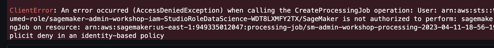
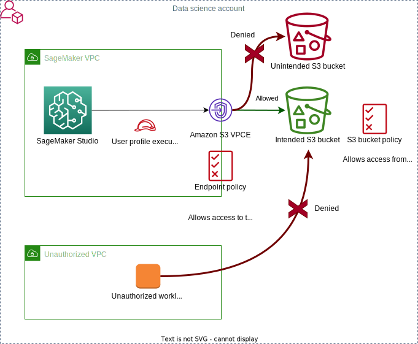
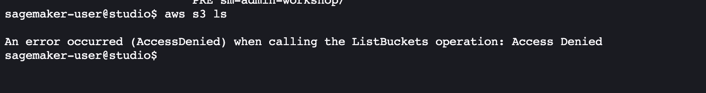
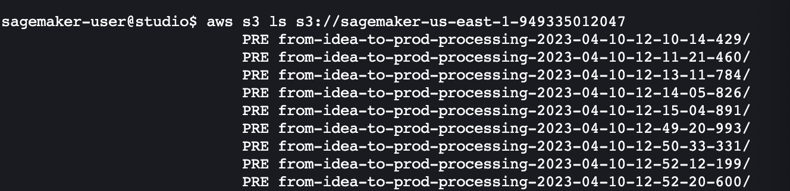
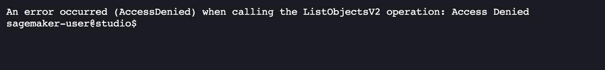
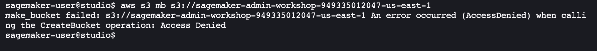
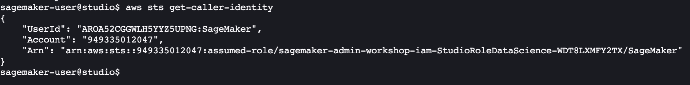

# Lab 2: data protection
This lab shows how to protect data in your ML environment. 

---

## What you're going to learn in this lab
In this lab you're going to do:
- Protect data at rest using encryption with AWS Key Management Service (KMS)
- Protect data in transit using encryption
- Implement role-based (RBAC) and attribute-based access control (ABAC)
- Implement S3 access control using IAM policies, VPC endpoints, and VPC endpoint policies
- Control access to SageMaker resources by using tags

## Where you must protect your data
The ML workflow can process, copy, generate, and store datasets resulting in multiple persistent or ephemeral data copies. In this context _persistent_ means the data exists until it's explicitly deleted. _Ephemeral_ means the data exists for the lifespan of a specific ML workload or process and is normally deleted as part of the implicit resource clean-up, for example after a SageMaker processing or training job finishes.

All these data copies are the additional threat vectors for your data security. You must be aware of them, monitor them, and implement a corresponding mitigation approach.

The following diagram shows possible locations and encryption state of your data in a common ML lifecycle:


The following table summarizes the characteristics of these possible data copies and a recommended protection approach:

Data location | Encryption | Lifetime | Data protection approach
---|---|---|---
Memory of the Jupyter notebooks, processing, and training job instances | Always-on memory encryption for [Graviton2](https://aws.amazon.com/ec2/graviton/), Ice Lake, and AMD EPYC based instances | Ephemeral | Use always-on memory encryption for critical data on supporting compute instances, see [Graviton-based instances for model deployment](https://aws.amazon.com/about-aws/whats-new/2022/10/amazon-sagemaker-adds-new-graviton-based-instances-model-deployment/) and [available Studio instance types](https://docs.aws.amazon.com/sagemaker/latest/dg/notebooks-available-instance-types.html)
SageMaker Studio EFS volume | At rest, by default with an AWS managed key | Persistent | Recommended to use a KMS key instead of an AWS managed key, use `KmsKeyId` parameter in SageMaker API
EBS volumes attached to Studio notebook instances | At rest, both OS and ML data volumes are encrypted by default with an AWS managed key | Ephemeral | Recommended to use a KMS key instead of an AWS managed key, use `KmsKeyId` parameter in SageMaker API
EBS volumes attached to SageMaker processing, batch transform, and training job containers | At rest, by default with an AWS managed key | Ephemeral | Recommended to use a KMS key instead of an AWS managed key, use `KmsKeyId` parameter in SageMaker API
Output from processing, training, and batch transform jobs stored in an S3 bucket | At rest, by default with an AWS managed key for S3 | Persistent | Recommended to use a KMS key instead of an AWS managed key, use `S3KmsKeyId` parameter in SageMaker API. Use S3 VPC endpoint policies to prevent write to any unauthorized S3 buckets. Enforce usage of the designated KMS key for `PutObject` S3 operation
[Data capture](https://docs.aws.amazon.com/sagemaker/latest/dg/model-monitor-data-capture.html) configurations with SageMaker endpoints and batch transform | At rest, by default with an AWS managed key | Persistent | Recommended to use a KMS keys, use `KmsKeyId` in [`DataCaptureConfig`](https://docs.aws.amazon.com/sagemaker/latest/APIReference/API_DataCaptureConfig.html) for encryption on EBS volume attached to the ML instance hosting the endpoint.
Notebook cell output | No encryption | Ephemeral | Use Studio notebooks [lifecycle configuration scripts](https://docs.aws.amazon.com/sagemaker/latest/dg/studio-lcc.html) to remove cell output periodically using [`jupyter/nbconvert`](https://github.com/jupyter/nbconvert). Start with the example for [auto-shutdown](https://github.com/aws-samples/sagemaker-studio-auto-shutdown-extension)
Git-committed notebook with cell output | No encryption | Persistent | Use Git [pre-commit hooks](https://git-scm.com/book/en/v2/Customizing-Git-Git-Hooks) to remove cell output, implement automated scanning in Git repositories
Git-committed datasets | No encryption | Persistent | Implement automated scanning in Git repositories, use pre-commit hooks
Shared Studio notebooks | At rest, by default with an AWS managed key | Persistent | Recommended to use a KMS key instead of an AWS managed key, use `S3KmsKeyId`. Disable notebook sharing at the domain level. Disable cell output sharing.
Another EC2 instance via Studio terminal or a processing or training script | Potentially no encryption | Persistent | Implement network isolation with VPC Security Groups for Studio and block any data transfer to unauthorized EC2 instances. Log all IP traffic.
SageMaker [Feature Store](https://docs.aws.amazon.com/sagemaker/latest/dg/feature-store.html) | At rest, by default with an AWS managed key | Persistent | Recommended to use a KMS key instead of an AWS managed key for offline and online store. Refer to [Security and Access Control](https://docs.aws.amazon.com/sagemaker/latest/dg/feature-store-security.html) for Feature Store
Another Amazon S3 bucket | Potentially no encryption | Persistent | Use S3 VPC endpoint policies to prevent write to any unauthorized S3 buckets and prevent any unencrypted write.
[Amazon Athena](https://docs.aws.amazon.com/athena/latest/ug/what-is.html) query result table | Not encrypted by default | Persistent | Refer to [Data protection in Athena](https://docs.aws.amazon.com/athena/latest/ug/security-data-protection.html) and [Encrypting Athena query results stored in Amazon S3](https://docs.aws.amazon.com/athena/latest/ug/encrypting-query-results-stored-in-s3.html)
Amazon EMR cluster | as configured | Persistent | Use Amazon EMR encryption approaches. Refer to [Data protection in Amazon EMR](https://docs.aws.amazon.com/emr/latest/ManagementGuide/data-protection.html)

❗ Certain Nitro-based SageMaker instances include local storage, depending on the instance type. Local storage volumes are encrypted using a hardware module on the instance. You can't use a KMS key on an instance type with local storage. For a list of instance types that support local instance storage, see [Instance Store Volumes](https://docs.aws.amazon.com/AWSEC2/latest/UserGuide/InstanceStorage.html#instance-store-volumes).

## Step 1: implement data encryption

### AWS KMS keys
The default encryption is performed with [AWS managed key](https://docs.aws.amazon.com/kms/latest/developerguide/concepts.html#aws-managed-cmk). The AWS managed keys in your account that are created, managed, and used on your behalf by an AWS service integrated with AWS KMS.

You have permission to view the AWS managed keys in your account, view their key policies, and audit their use in AWS CloudTrail logs. However, you cannot change any properties of AWS managed keys, rotate them, change their key policies, or schedule them for deletion. And, you cannot use AWS managed keys in cryptographic operations directly; the service that creates them uses them on your behalf.

The recommended practice is to create and use [customer managed keys](https://docs.aws.amazon.com/kms/latest/developerguide/concepts.html#customer-cmk). Customer managed keys are KMS keys in your AWS account that you create, own, and manage. You have full control over these KMS keys, including establishing and maintaining their key policies, IAM policies, and grants, enabling and disabling them, rotating their cryptographic material, adding tags, creating aliases that refer to the KMS keys, and scheduling the KMS keys for deletion.

### Using KMS key policies
Unlike other AWS resource policies, an AWS KMS key policy does not automatically give permission to the account or any of its principals. To give permission to any principal, including the account principal, you must give the permissions explicitly in the key policy.

Let's look at the key policy for Studio EFS/EBS KMS key we created in the Lab 1. 
The policy consists of three parts.

1. Enable IAM policies and allow access to the key for the AWS account:
```json
{
    "Sid": "Enable IAM User Permissions"
    "Effect": "Allow",
    "Principal": {
        "AWS": "arn:aws:iam::<ACCOUNT-ID>:root"
    },
    "Action": "kms:*",
    "Resource": "*"
}
```

It's important to understand, that this policy statement doesn't give any IAM principal permission to use the KMS key. Instead, it allows the account to use IAM policies to delegate the key permissions for all actions (`kms:*`) to the IAM policy statements attached to an IAM role. 

2. Allow users to use the KMS key:
```json
{
    "Sid": "Allow use of the key for Studio roles",
    "Effect": "Allow",
    "Principal": {
        "AWS": [
            "arn:aws:iam::949335012047:role/sagemaker-admin-workshop-iam-StudioRoleMLOps-1LJMIG785A20T",
            "arn:aws:iam::949335012047:role/sagemaker-admin-workshop-iam-StudioRoleDataScience-WDT8LXMFY2TX"
        ]
    },
    "Action": [
        "kms:Encrypt",
        "kms:Decrypt",
        "kms:ReEncrypt*",
        "kms:GenerateDataKey*",
        "kms:DescribeKey"
    ],
    "Resource": "*"
}
```

You can add IAM users, IAM roles, and other AWS accounts to the list of key users allowed to use the KMS key. In this workshop you allow two user profile execution roles to use the key for cryptographic operations.

3. Allow users to use the KMS key with AWS services
```json
{
    "Sid": "Allow use of the key with AWS services",
    "Effect": "Allow",
    "Principal": {
        "AWS": [
            "arn:aws:iam::949335012047:role/sagemaker-admin-workshop-iam-StudioRoleMLOps-1LJMIG785A20T",
            "arn:aws:iam::949335012047:role/sagemaker-admin-workshop-iam-StudioRoleDataScience-WDT8LXMFY2TX"
        ]
    },
    "Action": [
        "kms:CreateGrant",
        "kms:ListGrants",
        "kms:RevokeGrant"
    ],
    "Resource": "*",
    "Condition": {
        "Bool": {
            "kms:GrantIsForAWSResource": "true"
        }
    }
}
```

This key policy statement allows the key user to create, view, and revoke grants on the KMS key, but only when the grant operation request comes from an [AWS service integrated with AWS KMS](https://aws.amazon.com/kms/features/#AWS_Service_Integration). The `kms:GrantIsForAWSResource` policy condition doesn't allow the user to call these grant operations directly.

In a real-world environment you should consider the following recommended practices for managing your AWS KMS keys:
- Keep all KMS keys in a separate hardened and controlled account with only few administration roles
- Have a dedicated key administration role and give explicit key administration permissions in the key policy to this role
- Enable AWS CloudTrail to log and monitor all operations on the KMS keys

### AWS KMS key management end-to-end
The following diagram summarizes the most important details of the KMS key protection and data encryption using an KMS key.


1. AWS KMS stores and manages the customer-owned root encryption key. The root key never leaves the AWS KMS. All encryption and decryption operations with the root key happens inside the AWS KMS.
2. A key policy _explicitly_ controls all access to the key. No AWS principal, including the account root user or key creator, has any permissions to a AWS KMS key unless they are explicitly allowed, and never denied, in a key policy, IAM policy, or grant.
3. You entitle the key administration permissions (key enable/disable, key deletion and rotation) to an IAM role, which only the key administrators can assume. Only this IAM role and automatically the key administrator, can set the key policy, thus having the full control over the root key.
4. The key policy explicitly defines which IAM execution roles allowed to use the root key. No federated user is entitled to use the key, only IAM execution roles, such as the SageMaker execution role, processing and training job execution role, or pipeline execution role. Unless the key policy explicitly allows it, you cannot use user or role IAM permission policies to allow access to a KMS key. Without permission from the key policy, IAM permission policies that allow key permissions have no effect. You can use an IAM policy to deny a permission to a KMS key without permission from a key policy. IAM policies for the execution role explicitly enforce usage of the designated AWS KMS key for all data-related operations.
5. Data keys generated by AWS KMS is used to encrypt all data at rest at all possible data storage services, such as Amazon S3, Studio EFS volumes, training and processing job EBS volumes, and SageMaker Feature Store. Data is encrypted using the envelope encryption approach.
6. The [`GenerateDataKey`](https://docs.aws.amazon.com/kms/latest/APIReference/API_GenerateDataKey.html) AWS KMS API call returns a plaintext copy of the data key and a copy that is encrypted under a symmetric encryption KMS key that you specify (root key). The encrypted data key is stored together with the data.
7. As an additional level of security you can limit (deny) usage of specific root keys on the account level for any principal, for example based on tags or other conditions.
8. To connect directly to AWS KMS from your VPC without sending traffic over the public internet, use VPC endpoints. For more information, see [Connecting to AWS KMS through a VPC endpoint](https://docs.aws.amazon.com/kms/latest/developerguide/kms-vpc-endpoint.html).


### Enforce usage of a designated KMS key
In this exercise you're going to enforce Studio user to use a designated KMS key to encrypt input data for a processing or training job. We use the `sagemaker:VolumeKmsKey` IAM condition key to implement a `Deny` inline policy.

Navigate to the notebook `02-lab-02.ipynb` for the source code.

Replace the placeholder `EBS-KEY-ARN` with the key ARN and add the following inline policy to any of _DataScience_ or _MLOps_ user profile execution role. The CloudFormation stack for KMS key provisioning stored the key ARNs in the SSM parameter store. The notebook contains code to retrieve the key ARN.

```json
{
    "Version": "2012-10-17",
    "Statement": [
        {
            "Sid": "EnforceEncryption",
            "Effect": "Deny",
            "Action": [
                "sagemaker:CreateTrainingJob",
                "sagemaker:CreateProcessingJob"
            ],
            "Resource": "*",
            "Condition": {
                "ArnNotEquals": {
                    "sagemaker:VolumeKmsKey": "<EBS-KEY-ARN>"
                }
            }
        }

     ]
}
```

Follow the instructions in the notebook: create a `NetworkConfig`, create a processing job, run the Processor. First, don't provide the `volume_kms_key` parameter:
```python
# Create a processor
sklearn_processor = SKLearnProcessor(
    framework_version=framework_version,
    role=sm_role,
    instance_type=processing_instance_type,
    instance_count=processing_instance_count, 
    base_job_name='sm-admin-workshop-processing',
    sagemaker_session=sm_session,
    network_config=network_config,
    # volume_kms_key = ebs_key_arn
)
```

Run the processor:
```python
# Start the processing job
sklearn_processor.run(
        inputs=processing_inputs,
        outputs=processing_outputs,
        code='preprocessing.py',
        wait=True,
)
```

The execution fails immediately with an `AccessDeniedException` because of the `Deny` policy in the user profile execution role:



Now provide the `volume_kms_key` parameter for the processor:
```python
# Create a processor
sklearn_processor = SKLearnProcessor(
    framework_version=framework_version,
    role=sm_role,
    instance_type=processing_instance_type,
    instance_count=processing_instance_count, 
    base_job_name='sm-admin-workshop-processing',
    sagemaker_session=sm_session,
    network_config=network_config,
    volume_kms_key = ebs_key_arn
)
```

Run the processing job. This time the execution starts and succeeds.

### Enforce S3 bucket encryption
You can enforce S3 encryption in transit and at rest by using IAM conditions in the S3 bucket policy:
- Enforce S3 encryption in transit with `aws:SecureTransport` condition
- Enforce S3 encryption at rest by denying all un-encrypted object uploads or uploads with an incorrect encryption header

The following S3 bucket policy enforces these rules for a particular bucket:
```json
{
  "Id": "EnforceSSLPolicy",
  "Version": "2012-10-17",
  "Statement": [
    {
        "Sid": "DenyUnencryptedTraffic",
        "Action": "s3:*",
        "Effect": "Deny",
        "Principal": "*",
        "Resource": [
            "arn:aws:s3:::<BUCKET-NAME>",
            "arn:aws:s3:::<BUCKET-NAME>/*"
        ],
        "Condition": {
            "Bool": {
                "aws:SecureTransport": "false"
            }
        },
    },
    {
        "Sid": "DenyUnencryptedUploads",
        "Action": "s3:PutObject",
        "Effect": "Deny",
        "Principal": "*",
        "Resource": "arn:aws:s3:::<BUCKET-NAME>/*",
        "Condition": {
            "Null": {
                "s3:x-amz-server-side-encryption": "false"
            },
            "StringNotEqualsIfExists": {
                "s3:x-amz-server-side-encryption": "AES256"
            }
        }
    }
  ]
}
```

## Step 2: implement data access control
To implement multi-layer scalable data access control, you can use identity-based and resource-based IAM policies and attributed-based access control (ABAC) approach.


The ABAC is data access control based on the attributes on both the data resource and on the data accessing principal. In AWS terminology the attributes called _tags_. Sometimes you see the name tag-based access control (TBAC) in the AWS context. 
The general idea of the ABAC/TBAC is that the data access is only allowed when the attributes/tags of the accessed resource matches those of the principle. 

💡 **Assignment 02-01**: 
- Implement tag-based data access control following the blog post [Configuring Amazon SageMaker Studio for teams and groups with complete resource isolation](https://aws.amazon.com/fr/blogs/machine-learning/configuring-amazon-sagemaker-studio-for-teams-and-groups-with-complete-resource-isolation/).


## Step 3: implement data perimeter
In this step you're going to implement a data perimeter for an S3 bucket. You're going to allow access to a designated bucket via a designated S3 VPC endpoint:



### Amazon S3 access control with VPC endpoint polices
Developing ML models requires access to sensitive data stored on specific S3 buckets. You need to implement controls to guarantee that:

- Only specific Studio domains or SageMaker workloads and users can access these buckets
- Each Studio domain or SageMaker workload have access to the designated S3 buckets only

You can implement this requirement by using an S3 VPC Endpoint in your VPC and configuring VPC Endpoint and S3 bucket resource policies.

In this example you're going to secure the SageMaker default bucket. You can retrieve the bucket name using the SageMaker Python SDK `Session` helper: 
```python
bucket_name = sagemaker.Session().default_bucket()
```

First, attach the following S3 bucket policy to the SageMaker default bucket:
```json
{
    "Version": "2008-10-17",
    "Statement": [
        {
            "Effect": "Deny",
            "Principal": "*",
            "Action": [
                "s3:GetObject",
                "s3:PutObject",
                "s3:ListBucket"
            ],
            "Resource": [
                "arn:aws:s3:::<SageMaker-default-bucket-name>/*",
                "arn:aws:s3:::<SageMaker-default-bucket-name>"
            ],
            "Condition": {
                "StringNotEquals": {
                    "aws:sourceVpce": "<s3-vpc-endpoint-id>"
                }
            }
        }
    ]
}
```

The bucket policy explicitly denies all access to the bucket which does not come from the designated S3 endpoint in your VPC.

Second, attach the following permission policy to the S3 VPC Endpoint:
```json
{
    "Version": "2012-10-17",
    "Statement": [
        {
            "Effect": "Allow",
            "Principal": "*",
            "Action": [
                "s3:GetObject",
                "s3:PutObject",
                "s3:ListBucket"
            ],
            "Resource": [
                "arn:aws:s3:::<SageMaker-default-bucket-name>",
                "arn:aws:s3:::<SageMaker-default-bucket-name>/*"
            ]
        }
    ]
}
```
This policy allows access the specified S3 buckets only.

This combination of the S3 bucket policy and the VPC endpoint policy ensures that the Studio user profile can only access the intended S3 bucket, and this S3 bucket can only be accessed from the specified S3 VPC endpoint.

❗ You will not be able to access these S3 buckets from the AWS console or `aws cli`.

All network traffic between Amazon SageMaker Studio and S3 is routed via the designated S3 VPC Endpoint over AWS private network and never traverses public internet.

You may consider to enable access to other S3 buckets in the S3 VPC endpoint policy, for example to shared public SageMaker buckets, to enable additional functionality in the Amazon SageMaker Studio, like [JumpStart](https://docs.aws.amazon.com/sagemaker/latest/dg/studio-jumpstart.html).
If you want to have access to JumpStart, you must add the following statement to the S3 VPC endpoint policy:
```json
    {
      "Effect": "Allow",
      "Principal": "*",
      "Action": [
        "s3:GetObject"
      ],
      "Resource": "*",
      "Condition": {
        "StringEqualsIgnoreCase": {
          "s3:ExistingObjectTag/SageMaker": "true"
        }
      }
    }
```

### Test S3 access via VPC endpoints
After you configured and attached the permission polices, verify the access to the Amazon S3 buckets from the Studio. Run the following commands in the Studio terminal:

1. List all S3 buckets in your AWS account:
```sh
aws s3 ls
```


The S3 VPC endpoint policy blocks access to S3 `ListBuckets` operation.

2. List the intended S3 bucket (`SageMaker-default-bucket-name`):
```sh
aws s3 ls s3://<SageMaker-default-bucket-name>
```


The combination of the S3 bucket policy and the VPC endpoint policy allow access to the intended S3 bucket.

3. List an unintended S3 bucket, like any existing bucket in your AWS account in the same region:
```sh
aws s3 ls s3://<any other existing bucket in your AWS account>
```


This operation is denied because the VPC endpoint doesn't allow access to any unintended S3 buckets.

4. Create a new S3 bucket:
```sh
aws s3 mb s3://<a new bucket name>
```


The S3 VPC endpoint policy blocks access to any unintended S3 bucket and to unauthorized API such as `s3:CreateBucket`.

5. Check the Studio execution role:
```sh
aws sts get-caller-identity
```


All operations are performed under this Studio user profile execution role.

### Use VPC controls in SageMaker jobs
By default, containers access S3 via VPC Endpoints within the Platform VPC without traversing the public network. For more control, you may alternately connect the instance to your VPC for privately managed egress. You can require this through an [IAM condition key](https://docs.aws.amazon.com/service-authorization/latest/reference/list_amazonsagemaker.html#amazonsagemaker-policy-keys) on a policy attached to the role passed to SageMaker. [VPC mode](https://docs.aws.amazon.com/sagemaker/latest/dg/train-vpc.html) should be chosen when the S3 buckets containing the input/output data have policies restricting their access to specific customer-managed VPC Endpoints. Amazon SageMaker performs download and upload operations against Amazon S3 using your Amazon SageMaker execution role in isolation from the training container.

### Amazon S3 access points
You can control access to datasets with [Amazon S3 access points](https://docs.aws.amazon.com/AmazonS3/latest/userguide/access-points.html). A recommended practices is to define a designated access point for each application or team which requires a specific set of data entitlements. Implement access point policies enforcing usage of designated KMS keys and object tags. There is a default quota of 10,000 access points per account per Region. You can request a service quota increase if you need more than 10,000 access point for a single account in a single Region.

Consider [access points restrictions and limitations](https://docs.aws.amazon.com/AmazonS3/latest/userguide/access-points-restrictions-limitations.html)

## Step 4: implement resource isolation using tags
Following the same TBAC principle, you can implement access control and isolation for SageMaker resources, such as Studio, SagaMaker jobs, projects, model registry, and pipelines.

💡 **Assignment 02-02**: 
- Implement tag-based access control to SageMaker resources following the [example](https://docs.aws.amazon.com/sagemaker/latest/dg/security_iam_id-based-policy-examples.html#access-tag-policy) in the Developer Guide.

For a possible solution see [instructions](../800-solutions/lab-02-solutions.md) in the **Solutions** section of the workshop.

### SageMaker multi-domain setup
TBD

### Resource isolation for multi-domain

💡 **Assignment 02-03**: 
- Implement resource isolation based on automated SageMaker tags as described in [Domain resource isolation](https://docs.aws.amazon.com/sagemaker/latest/dg/domain-resource-isolation.html). 

You can use the following sample `Deny` policy:

```json
{
    "Version": "2012-10-17",
    "Statement": [
        {
            "Effect": "Allow",
            "Action": [
                "SageMaker:Create*",
                "SageMaker:Update*"
            ],
            "Resource": "*",
            "Condition": {
                "ForAllValues:StringEquals": {
                    "aws:TagKeys": [
                        "sagemaker:domain-arn"
                    ]
                }
            }
        },
        {
            "Effect": "Deny",
            "Action": [
                "SageMaker:Update*",
                "SageMaker:Delete*",
                "SageMaker:Describe*"
            ],
            "Resource": "*",
            "Condition": {
                "StringNotLikeIfExists": {
                    "aws:ResourceTag/sagemaker:domain-arn": "arn:aws:sagemaker:us-east-1:<ACCOUNT-ID>:domain/<DOMAIN-ID>"
                }
            }
        }
    ]
}
```

## Conclusion
In this lab you learned how you can protect your data using three foundational approaches: encryption, data access control, and data perimeter.

## Continue with the next lab
You can move to the [lab 3](../03-lab-03/lab-03.md) which demonstrates how to implement monitoring, governance guardrails and security controls.

## Additional resources
The following resources provide additional details and reference for data security and access topics.

- [Data protection in SageMaker Studio Administration Best Practices](https://docs.aws.amazon.com/whitepapers/latest/sagemaker-studio-admin-best-practices/data-protection.html)
- [Building a Data Perimeter on AWS](https://docs.aws.amazon.com/whitepapers/latest/building-a-data-perimeter-on-aws/building-a-data-perimeter-on-aws.html)
- [Establishing a data perimeter on AWS: Overview](https://aws.amazon.com/blogs/security/establishing-a-data-perimeter-on-aws/)
- [Establishing a data perimeter on AWS: Allow only trusted identities to access company data](https://aws.amazon.com/blogs/security/establishing-a-data-perimeter-on-aws-allow-only-trusted-identities-to-access-company-data/)
- [Protect Data at Rest Using Encryption](https://docs.aws.amazon.com/sagemaker/latest/dg/encryption-at-rest.html)
- [Configuring Amazon SageMaker Studio for teams and groups with complete resource isolation](https://aws.amazon.com/fr/blogs/machine-learning/configuring-amazon-sagemaker-studio-for-teams-and-groups-with-complete-resource-isolation/)
- [Key policies in AWS KMS](https://docs.aws.amazon.com/kms/latest/developerguide/key-policies.html)
- [What is ABAC for AWS?](https://docs.aws.amazon.com/IAM/latest/UserGuide/introduction_attribute-based-access-control.html)
- [AWS Key Management Service Best Practices](https://d1.awsstatic.com/whitepapers/aws-kms-best-practices.pdf)

---

Copyright Amazon.com, Inc. or its affiliates. All Rights Reserved.
SPDX-License-Identifier: MIT-0