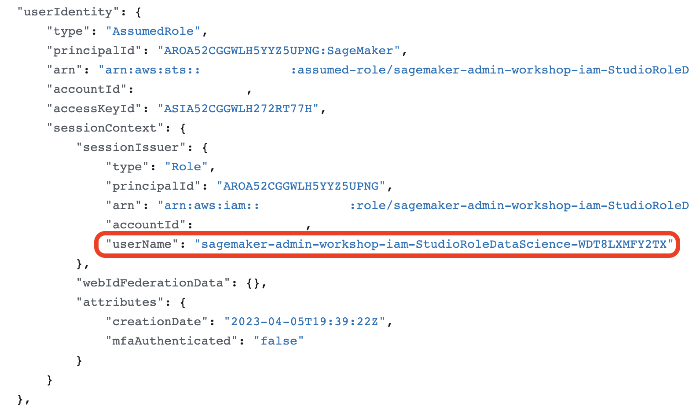
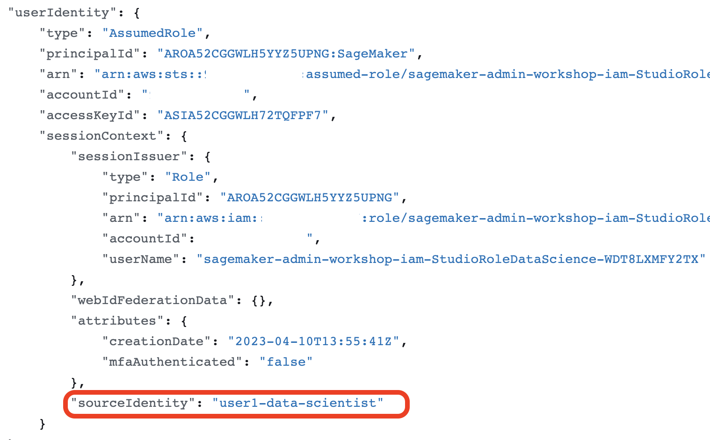
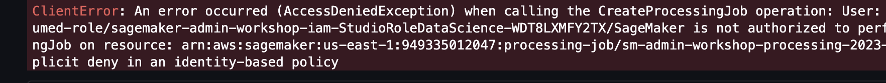

# Lab 3: Monitoring, governance, and security controls
This lab shows how to implement auditing, monitoring, and governance guardrails for your ML environments and workloads. The hands-on examples contain implementation of preventive, detective, and corrective security controls.

---

## What you're going to learn in this lab
In this lab you're going to do:
- Use AWS services [AWS CloudTrail](https://docs.aws.amazon.com/awscloudtrail/latest/userguide/cloudtrail-user-guide.html), [Amazon CloudWatch](https://docs.aws.amazon.com/AmazonCloudWatch/latest/monitoring/cloudwatch_concepts.html), and [Amazon S3 server access logging](https://docs.aws.amazon.com/AmazonS3/latest/userguide/ServerLogs.html) to monitor the access to API, resources, and to capture SageMaker job logs and metrics
- Implement preventive security controls with IAM policy conditions
- Implement detective and corrective security controls with [AWS Config](https://docs.aws.amazon.com/config/latest/developerguide/WhatIsConfig.html), [IAM Access Analyzer](https://docs.aws.amazon.com/IAM/latest/UserGuide/what-is-access-analyzer.html), and [AWS Security Hub](https://docs.aws.amazon.com/securityhub/latest/userguide/what-is-securityhub.html)
- Use [Amazon Macie](http://aws.amazon.com/macie/) to find and classify personally identifiable information (PII) in the training and inference data
- Learn what governance guardrails you can implement for ML workloads

## Step 1: logging and monitoring

### Monitoring with CloudWatch
By default, SageMaker publish activities like notebook usage, job metrics, endpoint serving metrics to CloudWatch logs. SageMaker uses the following log groups:
- `/aws/sagemaker/studio`: Studio logs, each user profile and app has their own stream under this group:
    - `/aws/sagemaker/studio/<USER-PROFILE-NAME>/JupyterServer/default`: JupyterServer logs
    - `/aws/sagemaker/studio/<USER-PROFILE-NAME>/JupyterServer/default/LifecycleConfigOnStart`: lifecycle script logs
    - `/aws/sagemaker/studio/<USER-PROFILE-NAME>/KernelGateway/datascience-app`: KernelGateway app logs
- `/aws/sagemaker/TrainingJobs`: Training job logs
- `/aws/sagemaker/ProcessingJobs`: Processing job logs

You can configure alarms for specified thresholds or messages in the logs, and publish events for user notification and automated event-based workflows.

Refer to the [Monitor Amazon SageMaker with Amazon CloudWatch](https://docs.aws.amazon.com/sagemaker/latest/dg/monitoring-cloudwatch.html) and [Log Amazon SageMaker Events with Amazon CloudWatch](https://docs.aws.amazon.com/sagemaker/latest/dg/logging-cloudwatch.html) in the Developer Guide for more details and supported event types.

Navigate to CloudWatch console in your account and open `/aws/sagemaker/studio` log group. Browse the log streams and log messages inside this group. 

This log group is important tool to troubleshoot any issues with Studio or apps, for example network connectivity problems.

### Logging with CloudTrail
CloudTrail is enabled by default for your AWS account. You can use **Event history** in the CloudTrail console to view, search, download, archive, analyze, and respond to account activity across your AWS infrastructure. This includes activity made through the AWS Management Console, AWS Command Line Interface, and AWS SDKs and APIs.

For this workshop you don't need to create a persistent trail to deliver log files to an Amazon S3 bucket.

In a real-time production environment it's a recommended practice to [create](https://docs.aws.amazon.com/awscloudtrail/latest/userguide/cloudtrail-create-and-update-a-trail.html) at least one trail and persistently save all CloudTrail events to a designated S3 bucket.

Refer to the [Log SageMaker API Calls with CloudTrail](https://docs.aws.amazon.com/sagemaker/latest/dg/logging-using-cloudtrail.html) in the Developer Guide for setup, configuration, and working with CloudTrail logs and trails.

All SageMaker API actions except of `InvokeEndpoint` and `InvokeEndpointAsync` are logged with CloudTrail. `InvokeEndpoint` is the API process through which inferences are obtained by a client application from a deployed SageMaker model. Logging these actions would need to be handled by the client application if desired. Some `InvokeEndpoint` information is available via CloudWatch metrics.

API calls that SageMaker instances, such as processing or training jobs, make on your behalf to other services such as S3, are also logged in CloudTrail and will reflect the IAM role assigned to the instances.

Open the `03-lab-03.ipnyb` notebook in the Studio and call some SageMaker API to generate CloudTrail entries. Move to the next section to see the log entries and to enable user source identity for the logs.

#### Enable `sourceIdentity` configuration for the domain
AWS CloudTrail logs for resource access and API class from a Studio user profile contain only the Studio execution role as the user identity. 

Navigate to the AWS CloudTrail console and [view the CloudTrail event history](https://docs.aws.amazon.com/awscloudtrail/latest/userguide/view-cloudtrail-events.html). Filter events by **Event source**=`sagemaker.amazonaws.com` and **User name**=`SageMaker`. These events are originating from the operations performed by a user profile in the Studio. Open any of these events. The CloudTrail event contains the name of the user execution role as `userName` within the `userIdentity` object:



If you need to log each individual Studio user profile activity, you must [enable](https://docs.aws.amazon.com/sagemaker/latest/dg/monitor-user-access.html) `sourceIdentity` configuration to propagate the Studio user profile name to CloudTrail logs. 

Perform the following steps to turn on the `sourceIdentity` for the domain:

1. Stop all apps in the domain for all user profiles. Follow the [instructions](https://docs.aws.amazon.com/sagemaker/latest/dg/studio-tasks-update-apps.html) in the Developer Guide to shut down apps.
2. Update the trust policy for all user profile execution roles – add `sts:SourceIdentity` permission:
```json
{
    "Version": "2012-10-17",
    "Statement": [
        {
            "Effect": "Allow",
            "Principal": {
                "Service": "sagemaker.amazonaws.com"
            },
            "Action": [
                "sts:AssumeRole",
                "sts:SetSourceIdentity"
            ]
        }
    ]
}
```
3. Run the `update-domain` AWS CLI command in your local or Cloud9 terminal:
```sh
aws sagemaker update-domain \
    --domain-id <DOMAIN-ID> \
    --domain-settings-for-update "ExecutionRoleIdentityConfig=USER_PROFILE_NAME"
```
4. Sign in to Studio via one of the user profiles. After approx. 5 min the JupyterServer app is created and the Studio UX comes up.

Now you can call some API from the Studio notebook, for example `DescribeDomain`. 
Navigate to the CloudTrail event history and validate that you can view the user profile in the log entry for the service accessed. The user profile is given as the `sourceIdentity` value in the `userIdentity` section:



### Configure Amazon S3 server access logging

## Step 2: security controls

### Preventive
You can control access to resources and AWS services with IAM identity-based and resource-based policies by attaching them to AWS principals or resources. A policy is an JSON declaration that, when associated with an identity or resource, defines their permissions. 

You use the _identity-based polices_ to control what actions users and roles can perform, on which resources, and under what conditions. You can use _inline_ or _managed_ policies.

You use the _resource-based polices_ attached to a resource to control what actions a specified identity or role can perform on that resource and what conditions. You must specify a principal in a resource-based policy. Resource-based polices are always _inline policies_.

The IAM policies are _preventive_ per definition, because they _block_ any unauthorized access if all conditions in all policies attached to a principal or a resource aren't fulfilled.

Refer [Identity and Access Management for Amazon SageMaker](https://docs.aws.amazon.com/sagemaker/latest/dg/security-iam.html) for more details on IAM.

You can use specific [condition keys for Amazon SageMaker](https://docs.aws.amazon.com/service-authorization/latest/reference/list_amazonsagemaker.html#amazonsagemaker-policy-keys) in the `Condition` element of an IAM policy.

For example, the following condition keys might be useful to limit and enforce user access preventively: 

- `sagemaker:InstanceTypes` – Limit the instance types allowed in SageMaker API requests
- `sagemaker:InterContainerTrafficEncryption` – Enforce the use of inter-container traffic encryption in training or processing jobs. 
- `sagemaker:NetworkIsolation` – Enforce network isolation for container runtime 
- `sagemaker:OutputKmsKey` – Enforce use of specific KMS key to encrypt outputs 
- `sagemaker:VolumeKmsKey` – Enforce use of specific KMS key to encrypt EBS volumes
- `sagemaker:VpcSubnets` – Enforce use of specific subnets in VPC mode 
- `sagemaker:VpcSecurityGroupIds` – Enforce use of specific security groups for ENIs
- `sagemaker:RootAccess` – Enforce removal of root privilege in SageMaker Notebook Instances 

Very often you use the following global condition keys to implement tag-based (ABAC) resource access control:

- `aws:RequestTag/${TagKey}` - Enforce matching of a specific tag key-value pair in an API call
- `aws:ResourceTag/${TagKey}` - Enforce matching of a specific tag key-value pair in a resource
- `aws:TagKeys `- Enforce use of specific tag keys in an API call

Check the [list of SageMaker actions and supported IAM condition keys](https://docs.aws.amazon.com/service-authorization/latest/reference/list_amazonsagemaker.html) to see which SageMaker action support which condition keys.

#### Enforce VPC configuration
In this example, you're going to use the SageMaker condition keys `sagemaker:VpcSubnets` and `sagemaker:VpcSecurityGroupIds` to enforce usage of VPC configuration and security groups in any user-created SageMaker jobs, such as processing, training, model, autoML, or model monitoring.

Replace the placeholder `ACCOUNT_ID` with your AWS Account ID and add the following inline policy to any of _DataScience_ or _MLOps_ user profile execution role:
```json
{
    "Version": "2012-10-17",
    "Statement": [
        {
            "Condition": {
                "Null": {
                    "sagemaker:VpcSubnets": "true",
                    "sagemaker:VpcSecurityGroupIds": "true"
                }
            },
            "Action": [
                "sagemaker:CreateHyperParameterTuningJob",
                "sagemaker:CreateProcessingJob",
                "sagemaker:CreateTrainingJob",
                "sagemaker:CreateModel",
                "sagemaker:CreateModelBiasJobDefinition",
                "sagemaker:CreateModelExplainabilityJobDefinition",
                "sagemaker:CreateModelQualityJobDefinition",
                "sagemaker:CreateAutoMLJob*",
                "sagemaker:CreateMonitoringSchedule",
                "sagemaker:UpdateMonitoringSchedule"
            ],
            "Resource": [
                "arn:aws:sagemaker:*:<ACCOUNT_ID>:*"
            ],
            "Effect": "Deny"
        }
    ]
}
```

Run the code cell to start a processing job without `NetworkConfig`:
```python
# Create a processor
sklearn_processor = SKLearnProcessor(
    framework_version=framework_version,
    role=sm_role,
    instance_type=processing_instance_type,
    instance_count=processing_instance_count, 
    base_job_name='sm-admin-workshop-processing',
    sagemaker_session=sm_session,
    # network_config=network_config
)

# Start the processing job
sklearn_processor.run(
        inputs=processing_inputs,
        outputs=processing_outputs,
        code='preprocessing.py',
        wait=True,
)
```

You get `AccessDeniedException` because of the explicit `Deny` in the IAM policy:



Now add the `NetworkConfig` to the processor:
```python
sklearn_processor = SKLearnProcessor(
    framework_version=framework_version,
    role=sm_role,
    instance_type=processing_instance_type,
    instance_count=processing_instance_count, 
    base_job_name='sm-admin-workshop-processing',
    sagemaker_session=sm_session,
    network_config=network_config
)
```

The code executes successfully and creates and runs a processing job.

You can go further, and enforce usage of the designated subnets in the job's network configuration.

Replace the `Condition` element in the previous policy with this more specific one with the private subnet ids:
```json
"Condition": {
    "ForAnyValue:StringNotLike": {
        "sagemaker:VpcSubnets": ["<PRIVATE SUBNET 1>","<PRIVATE SUBNET 2>"]
    }
}
```

Navigate to the notebook, set the `private_subnet_ids` to some unintended value, for example, to the id of a public subnet, re-create the `NetworkConfig`, and try to run the processing job. Because the configured subnet doesn't match the list of the allowed subnets, you have the immediate `AccessDeniedException` from the explicit `Deny` in the IAM policy.

### Detective controls
Detective controls identify potential security issues or threats or incidents that have already happened.

Detective controls based on logging and monitoring and leverage the following AWS services:
- Amazon CloudWatch
- AWS CloudTrail
- AWS Config
- VPC Flow Logs
- AWS Security Hub
- Amazon GuardDuty
- Amazon Macie

Detective controls can create and publish specific events based on the configured rules and filters. The events can launch user notification and also corrective control actions, which are responsible for damage limitation or an automated response to the event.

💡 **Assignment 03-01**: 
- Use Amazon Macie to detect sensitive data in S3 buckets in your account.

### Corrective controls
Corrective controls implement re-active correction of user actions or changes in the monitored environment. For example, you can stop SageMaker job instances if the instance type is not approved for use in your environment.

The following AWS services are normally used to implement event-driven workflows for the incident detection and response:
- AWS Config
- IAM Access Analyzer
- Amazon Security Hub
- AWS Lambda

💡 **Assignment 03-02**:
- Configure AWS Config for your account

💡 **Assignment 03-03**:
- Browse Access Analyzer findings in your account

💡 **Assignment 03-04**:
- Configure Amazon Security Hub and explore what [specific Amazon SageMaker controls](https://docs.aws.amazon.com/securityhub/latest/userguide/sagemaker-controls.html) it offers.

## Step 3: guardrails for ML environments

🚧 This part is coming in the next version of the workshop. 🚧

## Conclusion
In this lab you learned how to implement another important line of defense for your in-depth security architecture. You learned how to use logging services AWS CloudTrail and Amazon CloudWatch with SageMaker, how to implement preventive controls with IAM identity-based and resource-based policies, and how to implement detective and corrective controls.

## Continue with the clean-up
If you do this workshop in your own AWS Account, you must delete provisioned resources to avoid costs. Navigate to the [clean-up](../900-clean-up/clean-up.md) instructions now.

## Additional resources
- [Logging and monitoring in SageMaker Studio Administration Best Practices whitepaper](https://docs.aws.amazon.com/whitepapers/latest/sagemaker-studio-admin-best-practices/logging-and-monitoring.html)
- [AWS Security Incident Response Guide](https://docs.aws.amazon.com/whitepapers/latest/aws-security-incident-response-guide/aws-security-incident-response-guide.html)
- [Permission management](https://docs.aws.amazon.com/whitepapers/latest/sagemaker-studio-admin-best-practices/permissions-management.html)
- [Monitor SageMaker in the Developer Guide](https://docs.aws.amazon.com/sagemaker/latest/dg/monitoring-overview.html)
- [Monitoring in AWS Well-Architected Framework Machine Learning Lens](https://docs.aws.amazon.com/wellarchitected/latest/machine-learning-lens/ml-lifecycle-phase-monitoring.html)
- [SageMaker IAM conditions and actions](https://docs.aws.amazon.com/sagemaker/latest/dg/security-iam.html)
- [Journey to Adopt Cloud-Native Architecture Series #5 – Enhancing Threat Detection, Data Protection, and Incident Response](https://aws.amazon.com/blogs/architecture/journey-to-adopt-cloud-native-architecture-series-5-enhancing-threat-detection-data-protection-and-incident-response/)
- [Amazon SageMaker for SysOps workshop](https://sagemaker-workshop.com/security_for_sysops.html)

---

Copyright Amazon.com, Inc. or its affiliates. All Rights Reserved.
SPDX-License-Identifier: MIT-0