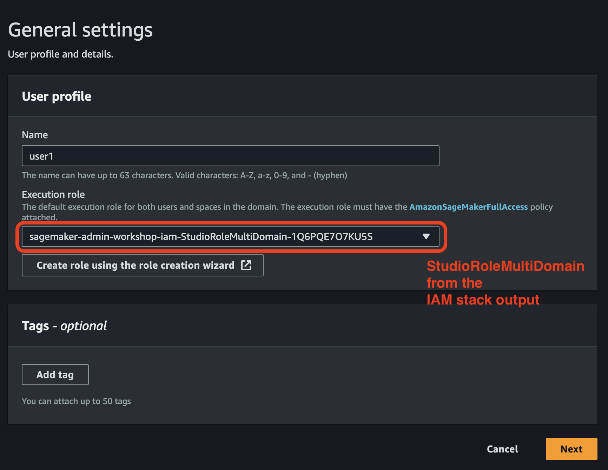
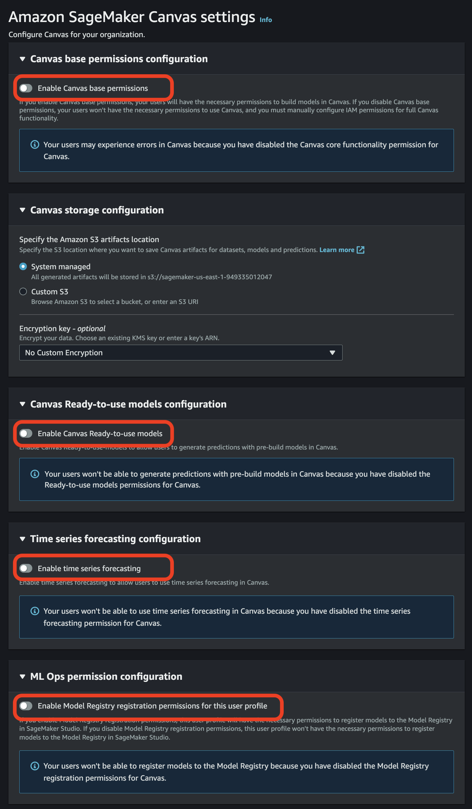

# Solutions for the assignments in the lab 2
These are the solution for the assignments in the lab 2.

## Solution for the assignment 02-01
> Implement tag-based data access control following the blog post [Configuring Amazon SageMaker Studio for teams and groups with complete resource isolation](https://aws.amazon.com/fr/blogs/machine-learning/configuring-amazon-sagemaker-studio-for-teams-and-groups-with-complete-resource-isolation/).

## Solution for the assignment 02-02
> Implement tag-based access control to SageMaker resources following the [example](https://docs.aws.amazon.com/sagemaker/latest/dg/security_iam_id-based-policy-examples.html#access-tag-policy) in the Developer Guide.

This sample solution implements resource isolation for user profiles using resource tags. We're going to control access to SageMaker processing and training jobs based on the project membership and the tags attached to the user profile execution roles.

We simulate the following setup:
- There are two teams, the **team A** and the **team B** with users in each team
- The access to SageMaker processing and training jobs is based on the team membership. All users in the team A can access jobs created by any member of the team A only, and cannot access any jobs created by the team B users. The same requirements for the team B users, which can access jobs created by the team B only.

- Team A users:
    - `user1-data-scientist`: the user profile is created in the lab 1
- Team B users:
    - `user2-mlops`: the user profile is created in the lab 1

The user profiles for these users have different execution roles. Each role is tagged with a tag `team` key with the value `Team-A` or `Team-B`.

### See user profile execution role tags
We're going to use AWS CLI in the terminal to run the following commands. You can also use AWS Console UX or Python SDK boto3.

```sh
# Set the DOMAIN_ID explicitly if you have multiple domains
export DOMAIN_ID=$(aws sagemaker list-domains --output text --query 'Domains[0].DomainId')
export USER_PROFILE_NAME="user1-data-scientist"

# See the user profile execution role
aws sagemaker describe-user-profile \
    --domain-id $DOMAIN_ID \
    --user-profile-name $USER_PROFILE_NAME
```

Now print the tags for the execution role. Use the execution role name from the user profile output in the following command:
```sh
aws iam list-role-tags --role-name <EXECUTION-ROLE-NAME>
```

The output looks like this:
```json
{
    "Tags": [
        {
            "Key": "team",
            "Value": "team-A"
        },
        {
            "Key": "role-type",
            "Value": "datascience"
        },
        {
            "Key": "project",
            "Value": "sagemaker-admin-workshop:us-east-1:<ACCOUNT-ID>"
        }
    ],
    "IsTruncated": false
}
```

You can now print the tags for the execution role for the user profile of the second user `user2-mlops`. The tag `team` is set to `team-B` value for that execution role.

### Attach the IAM permission policy to the execution role
To control resource access and enforce tag usage you're going to use an IAM permission policy. The CloudFormation [IAM stack](../../cfn-templates/iam-roles.yaml) you deployed in the lab 1 has already pre-provisioned such a policy. Let's take a look on it.

Print the IAM stack output and note the value of `TagBasedResourceIsolationPolicyArn`:
```sh
aws cloudformation describe-stacks \
    --stack-name sagemaker-admin-workshop-iam  \
    --output table \
    --query "Stacks[0].Outputs[*].[OutputKey, OutputValue]"
```

You can see the policy in the [AWS IAM Console](https://us-east-1.console.aws.amazon.com/iamv2/home?#/policies) or also using AWS CLI as follows.

First, get the list of policy versions. You should have only one version of the policy:
```sh
aws iam list-policy-versions --policy-arn <POLICY-ARN>
```

Second, get the JSON of the latest version:
```sh
aws iam get-policy-version --version-id <LATEST-VERSION> --policy-arn <POLICY-ARN>
```

The full policy is the following:
```json
{
    "Version": "2012-10-17",
    "Statement": [
        {
            "Condition": {
                "Null": {
                    "aws:ResourceTag/team": "false"
                },
                "StringNotEquals": {
                    "aws:ResourceTag/team": "${aws:PrincipalTag/team}"
                }
            },
            "Action": [
                "sagemaker:AddTags",
                "sagemaker:DeleteTags"
            ],
            "Resource": [
                "arn:aws:sagemaker:*:<ACCOUNT-ID>:*"
            ],
            "Effect": "Deny",
            "Sid": "DenyAddDeleteTagsIfTagExists"
        },
        {
            "Condition": {
                "StringNotEqualsIfExists": {
                    "aws:RequestTag/team": "${aws:PrincipalTag/team}"
                },
                "ForAnyValue:StringEqualsIgnoreCase": {
                    "aws:TagKeys": [
                        "team"
                    ]
                }
            },
            "Action": [
                "sagemaker:AddTags",
                "sagemaker:CreateProcessingJob",
                "sagemaker:CreateTrainingJob"
            ],
            "Resource": [
                "arn:aws:sagemaker:*:<ACCOUNT-ID>:*"
            ],
            "Effect": "Deny",
            "Sid": "DenyActionForUnintendedValue"
        },
        {
            "Condition": {
                "Null": {
                    "aws:RequestTag/team": "true"
                }
            },
            "Action": [
                "sagemaker:CreateProcessingJob",
                "sagemaker:CreateTrainingJob"
            ],
            "Resource": [
                "arn:aws:sagemaker:*:<ACCOUNT-ID>:*"
            ],
            "Effect": "Deny",
            "Sid": "DenyIfNoTags"
        },
        {
            "Condition": {
                "StringNotEqualsIfExists": {
                    "aws:ResourceTag/team": "${aws:PrincipalTag/team}"
                }
            },
            "Action": [
                "sagemaker:DeleteProcessingJob",
                "sagemaker:StopProcessingJob",
                "sagemaker:UpdateProcessingJob",
                "sagemaker:DescribeProcessingJob",
                "sagemaker:DeleteTrainingJob",
                "sagemaker:StopTrainingJob",
                "sagemaker:UpdateTrainingJob",
                "sagemaker:DescribeTrainingJob"
            ],
            "Resource": [
                "arn:aws:sagemaker:*:<ACCOUNT-ID>:*"
            ],
            "Effect": "Deny",
            "Sid": "DenyIfNoTagMatch"
        }
    ]
}
```

Now you must attach this policy to the both user profile's execution roles.

Attach the policy to the execution role of the user `user1-data-scientist`:
```sh
aws iam attach-role-policy \
    --role-name  <DATA-SCIENCE-EXECUTION-ROLE-NAME> \
    --policy-arn <POLICY-ARN>
```

Print the execution role for the user `user2-mlops`:
```sh
export USER_PROFILE_NAME=user2-mlops
aws sagemaker describe-user-profile \
    --domain-id $DOMAIN_ID \
    --user-profile-name $USER_PROFILE_NAME
```

Attach the policy to the execution role of the user `user2-mlops`:
```sh
aws iam attach-role-policy \
    --role-name <MLOPS-EXECUTION-ROLE-NAME> \
    --policy-arn <POLICY-ARN>
```

### Experiments
With the same permission policy attached to the **both execution roles**, you can start experimenting with the resource isolation. Navigate to the notebook [`02-lab-02.ipynb`](../../notebooks/02-lab-02.ipynb) and follow the instructions in the **Resource isolation using tags** section.

### Clean up
After you finish experimentation, remove the resource-isolation policy from the user profile execution roles:
```sh
aws iam detach-role-policy \
    --role-name <DATA-SCIENCE-EXECUTION-ROLE-NAME> \
    --policy-arn <POLICY-ARN>

aws iam detach-role-policy \
    --role-name <MLOPS-EXECUTION-ROLE-NAME> \
    --policy-arn <POLICY-ARN>
```

### Limitations of TBAC in SageMaker context
❗ You can use tags and access control based on tags only with resources and APIs which support tags. Some SageMaker resources, such as pipeline executions, image versions cannot be tagged. You cannot control access to these resources with TBAC. All SageMaker `List*` API doesn't support tag-based resource isolation. Even if a user isn't allowed to access resource details using `Describe*` API, the user is still able to list not-owned resources using by calling `List*` via AWS CLI or SageMaker API.

## Solution for the assignment 02-03
> Implement resource isolation between domains in the same AWS Account based on the automated SageMaker tags as described in [Domain resource isolation](https://docs.aws.amazon.com/sagemaker/latest/dg/domain-resource-isolation.html). 

To experiment with tag-based domain isolation you need at least two domains. One domain you created in the lab 1. Follow the instructions in the section [Step 4: onboard to SageMaker domain](../01-lab-01/lab-01.md#step-4-onboard-to-sagemaker-domain) of the lab 1 to create the second domain. Use the same VPC and subnet configuration for the new domain.

Wait until the creation of the domain is completed.

### Setup environment
You need to create a new user profile in the second domain. You're going to attach a resource-isolation permission policy to the user profile execution role.

#### Create a user profile
You can create a new user profile using AWS Console or AWS CLI. 

##### AWS Console
For the UX-based creation, sign in the AWS account and navigate to the second domain you've just created. 

Choose **Add user** on the **Domain details** pane. Select the execution role equal to the value of the IAM stack parameter `StudioRoleMultiDomainArn`:



Choose **Next**. Keep **Studio settings** and **RStudio settings** default and **disable** all configurations in **Amazon SageMaker Canvas settings**:



Wait until the user profile created.

##### AWS CLI
Alternatively you can create a new user profile via AWS CLI using the following command:

```sh
aws sagemaker create-user-profile \
    --domain-id <DOMAIN-ID> \
    --user-profile-name user1 \
    --user-settings '{"ExecutionRole":"<STUDIOROLE-MULTIDOMAIN-ARN>"}'
```

#### Assign a resource isolation permission policy
Now you assign the resource isolation permission policy to the user profile execution role.

Navigate to the [AWS IAM console](https://us-east-1.console.aws.amazon.com/iamv2/home#/roles), find the `StudioRoleMultiDomain` execution role and add the following inline permission policy to the execution role:

```
{
    "Version": "2012-10-17",
    "Statement": [
        {
            "Sid": "CreateAPIs",
            "Effect": "Allow",
            "Action": "sagemaker:Create*",
            "NotResource": [
                "arn:aws:sagemaker:*:*:domain/*",
                "arn:aws:sagemaker:*:*:user-profile/*",
                "arn:aws:sagemaker:*:*:space/*"
            ]
        },
        {
            "Sid": "ResourceAccessRequireDomainTag",
            "Effect": "Allow",
            "Action": [
                "sagemaker:Update*",
                "sagemaker:Delete*",
                "sagemaker:Describe*"
            ],
            "Resource": "*",
            "Condition": {
                "StringEquals": {
                    "aws:ResourceTag/sagemaker:domain-arn": "<DOMAIN-ARN>"
                }
            }
        },
        {
            "Sid": "AllowActionsThatDontSupportTagging",
            "Effect": "Allow",
            "Action": [
                "sagemaker:DescribeImageVersion",
                "sagemaker:UpdateImageVersion",
                "sagemaker:DeleteImageVersion",
                "sagemaker:DescribeModelCardExportJob",
                "sagemaker:DescribeAction"
            ],
            "Resource": "*"
        },
        {
            "Sid": "ListAPIs",
            "Action": "sagemaker:List*",
            "Resource": "*"
        },
        {
            "Sid": "DeleteDefaultApp",
            "Effect": "Allow",
            "Action": "sagemaker:DeleteApp",
            "Resource": "arn:aws:sagemaker:*:*:app/<DOMAIN-ID>/*/jupyterserver/default"
        }
    ]
}
```

Replace `<DOMAIN-ARN>` and `<DOMAIN-ID>` with the domain ARN and domain id of the domain you've just created. 

You can execute the following CLI command to get the domain arn:
```sh
aws sagemaker describe-domain --domain-id=<DOMAIN-ID>
```

### Experiments
After you created the second domain, the user profile and attached the permission policy to the user profile execution role, sign in Studio **in the first domain** under any user profile. Navigate to the notebook [`02-lab-02.ipynb`](../../notebooks/02-lab-02.ipynb) and follow the instructions in the **Multi-domain resource isolation** section.

You can also experiment with the following sample `Deny`-only policy to allow access to the domain-owned resources only:

```json
{
    "Version": "2012-10-17",
    "Statement": [
        {
            "Effect": "Deny",
            "Action": [
                "SageMaker:Update*",
                "SageMaker:Delete*",
                "SageMaker:Describe*"
            ],
            "Resource": "*",
            "Condition": {
                "StringNotEqualsIfExists": {
                    "aws:ResourceTag/sagemaker:domain-arn": "arn:aws:sagemaker:<REGION>:<ACCOUNT-ID>:domain/<DOMAIN-ID>"
                }
            }
        }
    ]
}
```

This policy implements a stronger isolation by denying access to any resource without `sagemaker:domain-arn` tag or with the tag value which isn't equal to the current domain arn.

---

Copyright Amazon.com, Inc. or its affiliates. All Rights Reserved.
SPDX-License-Identifier: MIT-0