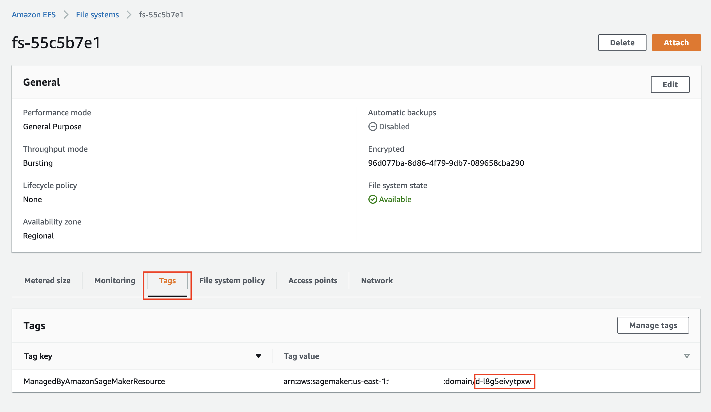

# Clean up workshop resources

❗ You don't need to perform a clean-up if you run an AWS-instructor led workshop.

## Clean up SageMaker resources
Run all steps in the provided [clean-up notebook](../../notebooks/99-clean-up.ipynb).

## Remove the SageMaker domain
If you used the AWS Console to provision a Studio domain as instructed in this workshop, and don't need the domain, you can delete the domain by following the instructions in the [Developer Guide](https://docs.aws.amazon.com/sagemaker/latest/dg/gs-studio-delete-domain.html). 

If you provisioned a Studio domain use a CloudFormation template, you can delete the CloudFormation stack in the AWS console.

## Delete Amazon EFS
❗ Delete the SageMaker EFS only if you provisioned a new SageMaker domain in your account. Do not delete your own existing EFS!

The deployment of the Studio created a new EFS in your account. This EFS is shared with all users of Studio and contains home directories for Studio users and may contain your data. Even if you delete all user profiles, apps, and the domain, the EFS **is not deleted** and kept "as is" in your account. Additional resources are created by the Studio and retained upon deletion together with the EFS:
- EFS mounting points in each private subnet of your VPC
- ENI for each mounting point
- Security groups for EFS inbound and outbound traffic

❗ To delete the EFS and EFS-related resources in your AWS account created by the workshop, do the following steps **after** deleting the domain.

❗ **This is a destructive action. All data on the EFS will be deleted (SageMaker home directories). You may want to backup the EFS before deletion.**
  
**From AWS console**  
Got to the [EFS console](https://console.aws.amazon.com/efs/home?#/file-systems) and delete the SageMaker EFS. You may want to backup the EFS before deletion.

To find the SageMaker EFS, click on the file system ID and then on the Tags tab. You see a tag with the Tag Key `ManagedByAmazonSageMakerResource`. Its Tag Value contains the SageMaker domain ID:

Make sure the tag value matches the SageMaker domain ID.

❗ If you have multiple EFS, double check that you selected the correct domain ID.

Click on the **Delete** button to delete this EFS.

## Delete CloudFormation stacks
Delete all CloudFormation stacks you provisioned in this workshop.

## Delete the SageMaker VPC
The VPC you provisioned in the lab 1 is retained in your account, you need manually delete this VPC.

Go to the [VPC console](https://console.aws.amazon.com/vpc/home?#vpcs) and delete the provisioned VPC. This will also delete all associated resources not deleted by the CloudFormation stack.

---

Copyright Amazon.com, Inc. or its affiliates. All Rights Reserved.
SPDX-License-Identifier: MIT-0